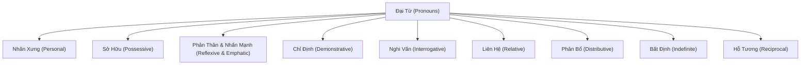

# Đại Từ (Pronouns)

> (Trang 27–50)

--- *Trang 27* ---

I. Định nghĩa (Definition)
Đại từ (pronouns) la từ dùng để thay thế cho danh từ.

H. Các loại đại từ (Kinds of pronouns)

Đại từ nhân xưng (personal pronouns)

Đại từ sở hữu (possessive pronouns)

Đại từ phản thân và đại từ nhấn mạnh (reflexive and emphatic pronouns)
Đại từ chỉ định (demonstrative pronouns)

Đại từ nghi vấn (interrogative pronouns)

Đại từ liên hệ (relative pronouns)

Đại từ phân bổ (distributive pronouns)

Đại từ bất định (indefinite pronouns)

Đại từ hỗ tương (reciprocal pronouns)

1. Đại từ nhân xưng (Personal pronouns)
Đại từ nhân xưng là Các đại từ được dùng để chỉ người, vật, nhóm người
hoặc vật cụ thể.

a.

Hình thức (Form)
Đại từ nhân xưng có hình thức chủ ngữ (subject) và tân ngữ (object) hoàn
toàn khác nhau (trừ you va it).

. Cách dùng (Use)

Đại từ nhân xưng được dùng để thay thế cho danh từ khi không cần thiết
sử dụng hoặc lặp lại chính xác danh từ hoặc cụm danh từ đó.
Ex: John’s broken his leg. He'll be in hospital for a few days.
(John bị gãy chân. Anh ấy sẽ phải nằm vién vai ngày.)
[NOT Jehn-will be-in-hospitol ..]
Tell Mary I miss her. (Hãy nói với Mary rằng tôi nhớ cô ấy.)
[NOT TeH-Mazy-I-miss-Mazy.)
I, he, she, we, they được dùng làm:
Chủ ngữ của động từ (subjects of a verb)

--- *Trang 28* ---

Ex: I like you. (Tôi thích anh.)
He wants to leave now. (Anh ấy muốn đi ngay bây giờ.)
They have lived here for twenty years. (Họ đã sống ở đây 20 năm rồi.)

- Bổ ngữ của động từ to be (complements of the verb Zo be)

Ex: It was I who chose this colour. (Chính tôi là người chọn màu này.)

» me, him, her, us, them được dùng làm

- Tân ngữ trực tiếp hoặc gián tiếp của động từ (direct objects or indirect
objects of a verb).

Ex: They called us on the telephone. (Họ đã gọi điện cho chúng tôi.)
Bill's uncle sent him a birthday present.
(Chú của Bill gửi cho anh ấy một món qua sinh nhật.)
- Tân ngữ của giới từ (objects of a preposition)
Ex: He said he couldn't live without her.
(Anh ấy nói anh ấy không thể sống thiếu cô ta.)

> you và it có thể được dùng làm chủ ngữ hoặc tân ngữ vì chúng có hình

thức chủ ngữ và tân ngữ giống nhau.

Ex: ~ Did you see the snake? (Anh có nhìn thấy con rắn không?)
~ Yes, I saw it and it saw me, too. (Có, tôi thấy nó va nó cũng thấy tôi.)
~ Did it frighten you? (Nó có làm anh sợ không?)

Lưu ý: Hình thức tân ngữ thvường được dùng khi đại từ đứng một mình hoặc sau be.

Ex Who spilt coffee all over the table? ~ Me./ Sorry, it was me.
(Ai làm đổ cà phê ra khắp bàn vậy? ~ Tôi./ Xin lỗi, chính tôi.)
But Who spilt coffee all over the table? ~ | did.
# Một số cách dùng của it
- It thvường được dùng thay cho vật, động vật, trẻ sơ sinh hoặc trẻ nhỏ (khi
giới tính không được biết hoặc không quan trọng).
Ex: I've bought a new watch. It’s very modern.
(Tôi vita mua đồng hồ deo tay mới. Nó rất hiện đại.)
Look at that bird. How beautiful it is! (Nhin con chim đó xem.Đẹp quá!)
The baby next door kept me awake. It cried all night.
(Đứa bé ở nhà bên làm tôi không ngủ được. Nó khóc suốt đêm.)

— It được dùng để chỉ người khi muốn xác định người đó là ai. Sau khi đã được
xác định, thi he hoặc she được sử dụng tùy theo người đó là nam hay nữ.
Ex: Who was it on the telephone? ~ It was Vicky. She just called to say

she’s arrived home safely. (Ai đã gọi điện vậy? ~ Vicky. Cô ấy vita
gọi để báo cô ấy đã vé đến nhà bình yên.)

There was a knock at the door. I thought it was the postman. He
usually came at that time. (Có tiếng gõ cửa. Tôi nghĩ đó là người đưa
thư. Anh ta thvường đến vào giờ đó.)

— Đại từ it (điều đó; nó) được dùng để chỉ một hành động, một tinh huống
hoặc một ý tưởng đã được nói đến trong một cụm từ, một mệnh đề hoặc
câu đi trước.

--- *Trang 29* ---

Ex: When the factory closes, it will means 500 people losing their jobs.
(Khi nhà máy đóng cửa, điều đó có nghĩa là sẽ có 500 người mất việc.)
Hit = the close of the factory]
He smokes in bed, though I đơn’t like it. (Anh ta hút thuốc trên
givường, mặc dù tôi không thích điều đó.) [it = his smoking in bed]

— Đại từ it được dùng như một chủ ngữ gia (formal subject) để nói về thời
tiết, thời gian, nhiệt độ, khoảng cách, số do.

Ex: It is raining heavily. (Trời đang mưa to.)
It is half past three now. (Bây giờ là 3 giờ ruõi.)
It is thirty degrees in this room. (Nhiệt độ trong phòng này là 30 độ.)
It is six miles to the nearest hospital from here.
(Khoảng cách từ đây đến bệnh viện gần nhất là 6 dặm.)
It is five meters long. (Chiều dài la 5 mét.)

— It được dùng làm chủ ngữ giả (formal subject) khi chủ ngữ that (real
subject) của câu là một động từ nguyên mẫu, một danh động từ hoặc một
mệnh đề ở cuối câu.

Ex: It was impossible to get a taxi at that time.
(Vào giờ đó không thể nào đón được taxi.)
[To get a taxi was impossible at that time.]
It's always sad saying goodbye to someone you love.
(Nói lời tạm biệt với người ma bạn yêu thương lúc nao cũng rất buồn.)
[Saying goodbye to someone you love is always sad.]
It’s a pity that you can’t come with us.
(Tiếc là bạn không thể đi với chúng tôi.)
[That you can't come with us is a pity.]

— It còn được sử dụng như một tân ngữ giả (formal object), theo sau nó la
một tính từ hoặc danh từ được bổ nghĩa bởi cụm từ hay mệnh đề.
Ex: I found it difficult to explain this to him.

(Tôi thấy khó giải thích điều này với anh ta.)

He thought it no use going over the subject again.

(Anh ta cho rằng xem xét lại vấn đề cũng chẳng ich lợi gi.)
I find it strange that she doesn’t want to travel.

(Tôi thấy lạ là cô ta không muốn di du lịch.)

— Đại từ it được dùng với động từ to be (It is/ was ...) để nhấn mạnh cho một

từ hoặc cụm từ trong câu.

Ex: It was Jim who lent us the money.
(Chính Jim đã cho chúng tôi mượn tiền.)
It was three weeks later that he heard the news.
(Đến ba tvần sau anh ta mới nghe tin.)

- Đại từ it đôi khi được sử dụng trong Các đặc ngữ có tính chất thân mật.
Ex: Hang it all, we can’t wait all day for him.

(Thật bực mình, chúng ta không thể đợi nó suốt cd ngày được).

--- *Trang 30* ---

When I see him, I'll have it out with him.

(Gặp nó tôi sẽ nói cho nó uỡ lẽ ra mới được).

If the teacher sees you doing that, you'll catch it.

(Thay mà thấy may làm vậy thi mày liệu hồn).

2. Đại từ sở hữu (Possessive pronouns)

Đại từ sở hữu (possessive pronouns) là hình thức sở hữu của đại từ nhân
xưng (personal pronouns), được dùng để chỉ vật gì thuộc về người nào đó.
a. Hình thức (Form)

| Personal Pronouns | Possessive Pronouns | Meaning |
|---|---|---|
| I | mine | cái của tôi |
| You | yours | cái của anh / bạn |
| He | his | cái của anh ấy |
| She | hers | cái của chị ấy |
| We | ours | cái của chúng tôi |
| They | theirs | cái của họ / chúng |
| It | — | (its là dạng tính từ sở hữu, không có đại từ sở hữu) |
b. Cách dùng (Use)
- Đại từ sở hữu được dùng không có danh từ theo sau. Nó thay thế cho tinh
từ sở hữu + danh từ (possessive adjective + noun)
Ex: Can I borrow your keys? I can’t find mine. (Tôi có thể mượn chìa
khóa của bạn được không? Tôi không tìm thấy chìa khóa của lôi.)
[mine = my keys]
You are using my pen. Wheres yours?
(Ban đang dùng viét của tôi đấy. Viết của bạn đâu?) [yours = your pen]
- Đại từ sở hữu cũng có thể được dùng trước danh từ mà nó thay thế.
Ex: Ours is the third house on the left.
(Nhà của chúng tôi là ngôi nhà thứ ba bên tay trái.) [ours = our house]
- không dùng mạo từ trước đại từ sở hữu.
Ex: That coat is mine. (Áo khoác đó của tôi) [NOT That-eoat-is the-mine.]
J Luu ý: Đôi khi ta có thể thấy đại từ sở hữu đứng sau giới từ of. Sự kết hợp này được gọi là
sở hữu kép (double possessive).
Ex. Tom is a friend of mine. (Tom là một người bạn của tôi.)
[a friend of mine = one of my friends]
| borrowed some magazines of yours. (Tôi đã mượn một số tạp chí của ban.)
[Some magazines of yours = some of your magazines]
8. Đại từ phản thân & đại từ nhấn mạnh (Reflexive and Emphatic
Pronouns)
a. Hình thức (Form)
Đại từ phản thân và đại từ nhấn mạnh có chung hình thức.

--- *Trang 31* ---

myself
yourself

(tự/ chính tôi)
(tự/ chính bạn)

He himself “ (tự! chính anh ấy)
She herself (tự! chính chị ấy)

It itself (tự/ chính nó)

We ourselves (tự! chính chúng tôi)
You yourselves (tự/ chính Các bạn)
They themselves (tự/ chính họ)

b. Cách dùng (Use)

s Đại từ phản thân (Reflexive pronouns)
Đại từ phản thân được dùng làm tân ngữ (object) của động từ khi hành
động của động từ do chủ ngữ thực hiện tác động lại ngay chính chủ ngữ.
Nói cách khác, đại từ phản thân được dùng khi chủ ngữ và tân ngữ của
động từ là cùng một đối tượng.

Ex: When the policeman came in, the gunman shot him.
(Khi viên cảnh sát xông vào, tên cướp da bắn anh ta.) [him = the police]
When the policeman came in, the gunman shot himself.
(Khi viên cảnh sát xông vào, tên cướp đã dùng súng tự sót.)
[himself = the gunman]
Jane looks at herself in the mirror. (Jane soi minh trong gương.)
We've locked ourselves out. (Chúng tôi tự khóa cửa nhốt mình bên ngoài.)
This refrigerator defrosts itself. (Tủ lạnh này tự rõ đông.)
Ngoài chủ ngữ của mệnh để, đại từ phần thân còn có thể chỉ những
thành phần khác trong câu.
Ex: His letters are all about himself.
(Thư của anh ta toàn viết vé bản than anh ta.)
I love you for yourself, not for your money.
(Tôi yêu em vi chính bản thân em chứ không phải vi tiền của em.)
^ Lưu ý: Đại từ phản thân có thể được dùng sau giới từ, nhưng sau giới từ chỉ vị trí
(preposition of place) chúng ta thvường dùng đại từ nhân xưng (me, you, him, her...)
Ex I'm annoyed with myself. (Tôi giận chính bản thân mình.)
But: Mike didn't have any money with him. (Mike không đem theo tiền.)
In the mirror | saw a lorry behind me. (Nhin vào gương tôi thấy một chiếc xe tải phía sau.)

s Đại từ nhấn mạnh (Emphatic pronouns)

Đại từ nhấn mạnh có cùng hình thức với đại từ phản thân, được dùng để
nhấn mạnh một danh từ hoặc đại từ. Đại từ nhấn mạnh thvường đứng
ngay sau từ được nhấn mạnh và có nghĩa là “chính người đó/ vat đó”.
Ex: My sister herself designed all these clothes.

(Chính chị tôi đã thiết hế những bộ qvần áo này.)

--- *Trang 32* ---

I spoke to the president himself.
(Tôi đã nói chuyện với chính ngài chủ tịch.)
The film itself wasn’t very good but I like the music.
(Bản thân bộ phim thi không hay lắm, nhưng tôi thích phần nhạc
trong phim.) 5
Khi nhấn mạnh chủ ngữ, đại từ nhấn mạnh có thể đứng cuối câu.
Ex: I saw him do it myself. (Chính mắt tôi thấy anh ta làm điều đó.)
[= I myself saw him do it.]
c. By + oneself = alone, without help
By myself] yourself| himself, .. có nghĩa ‘mét minh’ (alone) hoặc “không
có ai giúp đỡ (without help).
Ex: He likes living by himself. (Ong ta thích sống một minh.)
[= He likes living alone.]
Do you need help? ~ No, thanks. I can do it by myself.
(Ban có cần giúp không? ~ Không, cám ơn. Tôi có thể làm một mình.)
[= I can do it without help.]
4. Đại từ chi định (Demonstrative pronouns)
Đại từ chi định gồm Các từ: this, that, these, those. Đại từ chỉ định được dùng
để chỉ định vật, sự vật hoặc để giới thiệu hay nhận dạng người nào đó.
Ex: These are my candies. Those are yours.
(Đây la keo của tôi. Kia là kẹo của bạn.)
This costs more than that. (Cái này đắt hơn cái kia.)
This is my brother. (Đây là anh trai lôi.)
Who's that? ~ Thats Tom Jones. (Ai kia? ~ Đó là Tom Jones.)
a. This (cái nay/ người này), số nhiều là these (những cái nay/ những
người này) được dùng để
- chỉ vật ở khoảng cách gần (với người nói).
Ex: In all your paintings I like this best.
(Trong tất cả Các bức vẽ của ban tôi thích bức này nhất.)
These are my shoes.(Đây là giày của tôi.)
- giới thiệu người nào đó.
Ex: This is my brother. (Đây là anh tôi.)
These are the Smiths.(Pdy là ông bà Smiths.)
- chỉ tình huống và sự việc đang xảy ra, sắp sửa xảy ra hoặc sắp được nói tới.
Ex: Listen to this. You'll like it. (Hãy nghe cái này xem. Ban sẽ thích nó đấy.)
I đơn't like to say this, but I'm really not happy with the service here.
(Tôi không muốn nói điều nay, nhưng tôi thật sự không hai lòng với
cách phục vụ ở đây.)
b. That (cái kia/ người kia), số nhiều là those (những cái kia/ những
người kia) được dùng
- chỉ vật ở khoảng cách xa (với người nói).

--- *Trang 33* ---

Ex: That's Jerys car, over there. (Kia là xe hơi của Jery, ở kia kia.)
Put those down — they're dirty.
(Hãy đặt những cái đó xuống — chúng do lắm.)
This is my umbrella. That's yours. (Đây là dù của tôi. Đó là dù của bạn.)
- khi xác định hoặc nhận dạng người nao đó.
Ex: Is that Ruth? ~ No, that’s Rita.
(Kia la Ruth phải không? ~ Không phải. Đó la Rita.)
Who are those? ~ Those look like Mark and Susan.
(Những người kia là ai thể? ~ Trông như Mark va Susan.)
- Nói về điều gì đó trong quá khứ, điều gì đó vừa mới xdy ra hoặc vừa mới
được đề cập đến.
Ex: That was nice. What was it? (Cái đó thật đẹp. Nó là cái gì vậy?)
[NOT This-was-niee ...]
It was a secret - Thats why they never talked about it.
(Nó là một bí mật - Đó là lý do tai sao họ không bao giờ nói vé nó.)
> Trên điện thoại, chúng ta dùng this để nói chúng ta là ai, va this hoặc
that để hỏi người kia là ai.
Ex: Hello. This is Elisabeth. Is that/ this Ruth?
(Xin chào. Đây la Elisabeth. Có phải Ruth đó! đấy không?)

> This/ these, that/ those có thể được dùng thay cho một danh từ, một cụm
từ hoặc một mệnh dé đã được nói đến trước đó.
Ex: He hung his daughter's portrait beside that of his wife’s.
(Ong ta treo chân dùng con gdi ông ta bên cạnh chân dùng vg.)
that = portrait]
They are digging up my road. They do this every year.
(Ho dang dao xới con đvường trước nhà tôi. Nam nào họ cũng làm
việc này.)
this = digging up the road]
> Đại từ those có thể được theo sau bởi một mệnh đề quan hệ xác định hoặc
một ngữ phân từ để chỉ người.
Ex: Those who couldn’t walk were carried on stretchers.
(Những người không đi được thì được khiéng bằng cdng.)
Those who.. = The people who..]
Those injured in the accident were taken to hospital.
(Những người bi thương trong tai nạn đã được dua tới bệnh viện.)
those = people]
This boy of yours seems very intelligent.
(Cậu con trai nay của anh có vé rất thông minh.)
this boy of yourg = your boy] °
» This/ these, that/ those có thể đứng một mình hoặc có one/ ones theo
sau khi có sự so sánh hoặc lựa chọn.

--- *Trang 34* ---

Ex: I đơn’t like these sweaters. I prefer those (ones) over there.
(Tôi không thích những chiếc áo len nay. Tôi thích những chiếc ở
đằng kia hơn.)
This (one) looks the nicest. (Cái này có vé đẹp nhất.)
5. Đại từ nghi vấn (Interrogative pronouns)
Đại từ nghi vấn là Các đại từ dùng để hỏi như: who, whom, whose, what,
which. Các đại từ nghi vấn thvường đứng đầu câu và luôn đi trước động từ.
Ex: What do you want? (Bạn muốn gì?)
Whose is the red car? (Chiếc 6 tô màu đỏ của ai vdy?)
a. Who (ai): là đại từ nghi vấn dùng cho người, để hỏi tên, nét nhận dang,
hoặc chức năng của một hay nhiều người. Who có thể được dùng làm:
— Chủ ngữ của động từ (subject of a verb)
Ex: Who keeps the keys? (Ai giữ chìa khéa?)
Who is the man in grey coat?
(Người đàn ông mặc áo choàng xám là ai thế?)
— Tân ngữ của động từ hoặc giới từ (object of a verb or a preposition)
Ex: Who did you see at church? (Bạn đã gặp ai ở nhà tho?)
[who là tân ngữ của động từ see]
Who does this place belong to? (Nơi này thuộc vé ai vậy?)
[who là tân ngữ của giới từ to]
Luu ý: Trong trvường hợp who là tân ngữ của giới từ, giới từ luôn được đặt cuối câu.
Ex Who did you go with? (Anh đã di với ai?) [NOT With-who-did-you-go2]
b. Whom (ai): là đại từ nghi vấn dùng cho người. Whom được dùng làm tân
ngữ (object) cho động từ hoặc giới từ.
Ex: Whom did they invite? (Họ đã mời những ai?)
To whom were you speaking at that time?’ Whom were you speak-
ing to at that time? (Lúc đó bạn dang nói chuyện với ai vậy$)
Lưu ý:
~ Ca who và whom đều có thể làm tân ngữ của động từ hoặc giới từ, nhưng who thvường
được dùng hơn (nhất là trong lối nói thân mật). Whom thvường được dùng trong lối nói
trịnh trọng hoặc trong văn viết.
Ex. Who/ Whom did you invite to your party? (Ban mời những ai đến dự tiệc?)
= trong trvường hợp whom làm tân ngữ cho giới từ, giới từ có thể được đặt trước whom hoặc
đặt cuối câu. Cách dùng giới từ + whom thvường được dùng trong lối văn trịnh trọng.
Ex. Whom did you go with? or With whom did you go?
c. Whose (của ai): là đại từ nghi vấn dùng để hỏi về sự sở hữu. Whose được
dùng làm chủ ngữ của động từ.
Ex: Whose is that dog? (Con chó kia của ai?)
What about these jackets? Whose are they?
(Còn những chiếc áo vét nay thì sao? Chúng của ai vậy?)
[Whose là chủ ngữ của is và are]

--- *Trang 35* ---

d. What (cái gi): là đại từ nghi vấn dùng để hỏi về sự vật hoặc sự việc.
What có thể được dùng làm chủ ngữ của động từ hoặc tân ngữ của động từ
và giới từ.

Ex: What caused the explosion? (Cá; gì đã gây ra vu nổ?)
[What là chủ ngữ của caused] 8
What did you say? (Anh da néi gi?)
[What là tân ngữ của say]
What was your theory based on?/ On what was your theory based?
(Ly luận của bạn được căn cứ vào cái gì?)
[What là tân ngữ của on]
Một số cách dùng với What
What thvường được dùng để hỏi về thông tin.
Ex: What are you doing? ~ I'm writing a letter.
(Ban đang làm gi thể? ~ Tôi đang viết thư.)

- What được dùng để hỏi nghề nghiệp.

Ex: What is he? What does he do? (Anh ta làm nghề gì?)
[= What is his profession?]

What ... for? được dùng để hỏi về mục đích hoặc lý do.

Ex: What is this tool for? (Dụng cụ này để làm gì?)

What are they digging the road up for? ~ They're repairing a gas. pipe.
(Họ dao đvường để lam gì vậy? ~ Ho dang sửa ống dẫn gas.)
[= Why are they digging up the road?]

- What + be .. like? được dùng để hỏi về tính cách, tính chất, hoặc nét đặc

trưng của người, vật hay sự vật.

Ex: What was the exam like? ~ It was very difficult.
(Bài kiểm tra như thế nào? ~ Rat khó.)
What is David like? ~ He's short and fat and wears glasses./ Hes
very sociable. (David như thế nao? ~ Anh ấy mập lùn va mang
kinh./ Anh ấy rất thân thiện.)

+ How + be + (a thing)...? cũng có thể được dùng để yêu cầu mô tả một sự
vật hoặc sự việc nào đó.

Ex: How was the film? ~ It was very good. (Bộ phim thế nào? ~ Rất hay.)
[= What was the film like?]
~ What does he/ she/ it... look like? được dùng để hỏi về vẻ bề ngoài.
Ex: What does she look like? Shes tall and glamorous.
(Trông cô ta như thế nào? Cô ta cao va đầy quyến rũ.)

- What about + V-ing? (= How about + V-ing?) được dùng để đưa ra một gợi
ý hoặc dé nghị.

Ex: What about going for a walk? (Di dạo nhé?)

e. Which (nào, cái nào, người nào) là dai từ nghi vấn được dùng cho cả
người và vật, để chỉ sự lựa chọn trong số người hay vật đã được biết.

--- *Trang 36* ---

Which có thể được dùng làm chủ ngữ của động từ hoặc tân ngữ của động
từ và giới từ.
Ex: Which is your favourite subject?
(Môn học nào là môn bạn ưa thích nhất?)
Which is qvuicker, the bus or the train?
(Xe nao nhanh hơn, xe buýt hay xe lita?) [Which là chủ ngữ của is]
We have two Smiths here. Which (of them) do you want?
(Ở đây chúng tôi có hai người mang họ Smith. Anh cần gặp người nào?)
[Which là tân ngữ của động từ want]
There are two addresses in your card. Which do you want me to send
it to?/ To which do you want me to send it?
(Có hai địa chỉ trong danh thiếp của bà. Bà muốn tôi gửi nó đến địa
chỉ nao?) [Which là tân ngữ của giới từ to] 3
s Which có thể được dùng với of. Which of được dùng trước đại từ số nhiều
hoặc trước từ xác định (the, my, these, those ..) và danh từ số nhiều.

Ex: Which of these photos would you like?
(Bạn thích tấm nào trong số ảnh nay?)
‘Which of us is going to do the washing-up?
3 (Ai trong chúng ta sẽ rửa bát?)
J Lưu ý: Chúng ta có thể dùng which hoặc what để hỏi về sự lựa chọn
~ Which được dùng để chi sự lựa chọn trong một số lượng có giới hạn.
Ex. Theres gin, whisky and sherry. Which will you have?
(Có rượu gin, whisky và sherry. Anh muốn dùng loại nào?)
~ What được dùng khi có sự lựa chọn rộng rãi — không bị giới han trong một số lượng.
nhất định.
Ex What would you like to drink? (Anh muốn uống gì?)
1N07 Whiaroovuidyoodietoddniơil
. Đại từ quan hệ (Relative pronouns)
Các đại từ who, whom, whose, which, that là Các đại từ quan hệ được dùng
để thay cho danh từ đi trước và đồng thời có chức năng nối mệnh đề chính
với mệnh dé phụ trong mệnh dé liên hệ (relative clauses).
Who/ whom được dùng để chi người, which chỉ vật hoặc sự vật, that có thể
chỉ cả người lẫn vật và whose chỉ sự sở hữu. (Về nghĩa và cách dùng Các đại
từ quan hệ, xem Relative Clause)
. Đại từ phân bổ (Distributive pronouns)
Đại từ phân bổ gồm Các từ: all, most, each, both, either, neither.
a. All (tt cd): được dùng để chỉ toàn bộ số lượng người hoặc vật của một
nhóm từ ba trở lên. All có thể là chủ ngữ, tân ngữ hoặc bổ ngữ trong câu.

--- *Trang 37* ---

Ex: All were unaminous to vote him. (Tất cả đều nhất trí bầu ông ta.)

[All là chủ ngữ của were]

TH do all I can. (Tôi sẽ làm tất cả những gì có thể.)

[all là tân ngữ của do]

Wallet, ticket and a bunch of keys. That's all in his pocket.

(Vi tiền, vé va một chùm chìa khóa. Đó là tất củ những thứ trong túi anh ta.)

- All of được dùng trước danh từ (đếm được số nhiều hoặc không đếm

được) có từ xác định (the, my, this, ‡hese,..) hoặc dạng tân ngữ của đại
từ nhân xưng. Động từ theo sau ở hình thức số ít hay số nhiều tùy
thuộc vào danh từ.

Ex: All (of) my friends like riding. (Tất cả bạn be tôi đều thích cưỡi ngựa.)
All (of) the money has been spent. (Tất cả tiền đã bị tiêu sạch.)
All of us enjoyed the party. (Tất cả chúng tôi đều thích bữa tiệc.)
I'm going to invite all of you. (Tôi sẽ mời tất cả Các bạn.)

All of với nghĩa ‘whole’ toàn bộ) cũng có thể được dùng trước một số

danh từ đếm được số ít (singular countable noun) .

Ex: I've eaten all (of) the cake. (Tôi đã ăn hết cái bánh.)

[= I've eaten the whole cake.]

All (of) my family came to watch me playing in the concert.
(Cả nhà tôi đã đến xem tôi biểu diễn trong buổi hoa nhạc.)
[= My whole family came to watch...]

+ Oƒ có thể bỏ khi đứng trước danh từ, nhưng không được bỏ khi đứng trước
đại từ.

- All có thể đứng sau một chủ ngữ số nhiều hoặc đại từ nhân xưng được
dùng làm tân ngữ mà nó thẩm định.

Ex: These bvuildings all belong to the government.

(Tất cả những tòa nhà này đều thuộc vé chính phủ.)
He said goodbye to us all. (Anh ấy chào tam biệt tất cd chúng toi.)

- All có thể đứng sau trợ động từ (auxiliary verb) hoặc dong từ to be.

Ex: These cups are all dirty. (Tốt cả những cái tách này đều bi do.)

- All có thể được dùng với nghĩa ‘everything’ (mọi thứ, mọi điều); ‘the only
thing’ (cái duy nhất, điều duy nhất), nhưng trong trvường hợp này all
không được dùng một mình mà phải được theo sau bằng một mệnh dé
quan hệ [all + relative clause/ that clause].

Ex: All (that) I have is yours. (Tất cả những gi anh có la của em.)
[All = Everything]

But: Everything is yours. (Moi thi la của em.) [NOT AM is-youss.]
She lost all she owned. (Cô ta mất tất cả những gi cô ta có.)
[All = everything]

--- *Trang 38* ---

But: She lost everything. (Cô ta mất hết mọi thú.) [NOT She-lost-al.]
All I've eaten today is a sandwich. (Tất cd những gì tôi đã ăn hôm
nay là một cái xăng-uých.) [All = the only thing]

This is all Pve got. (Đây la tất cả những gi tôi có.)
[All = nothing more] :
+ All không được dùng với nghĩa ‘everybody/ everyone’ (mọi người).

Ex: Everybody enjoyed the party. (Tất cả mọi người đều thích bữa tiệc.)
[NOT AH-enjoyed-..]

b. Most (phần lớn; hầu hết): được dùng để chi phần lớn nhất của cái gì
hoặc đa số người hoặc vật.

Ex: We all ate a lot, but Ashley ate (the) most.

(Tất cả chúng tôi đều ăn nhiều, nhưng Ashley ăn nhiều nhất.)

All the victims were male, and most were between the ages of 15 and 25.
(Tất cả Các nạn nhân đều là nam, va đa số ở độ tuổi từ 15 đến 25.)
There are hundreds of verbs in English, and most are regular.
(Tiếng Anh có hàng trăm động từ, va đa số là động từ có quy tắc.)

Most of được dùng trước danh từ (đếm được hoặc không đếm được) có từ

xác định (a, the, my, this,..) hoặc hình thức tân ngữ của đại từ nhân

xưng. Động từ theo sau ở số ít hay số nhiều tùy thuộc vào danh từ.

Most of + determiner + noun (+ singular/ phai verb)
Ex: Most of the people here know each other.
(Hầu hết mọi người ở đây đều quen nhau.)
John spends most of his free time in the library.
(Phần lớn thời gian rảnh rỗi, John ở trong thư viện.)
He's eaten most of a chicken. (Anh ta ăn gần hết một con ga.)
Most of us enjoy shopping. (Pa số chúng tôi thích di mua sắm.)

c. Each (mỗi): được dùng để chi từng cá nhân hoặc từng đơn vi trong một

số lượng người hoặc vật từ hai trở lên.

Ex: I asked two children and each told a different story.
(Tôi hỏi hai đứa trẻ va mỗi đứa ké một câu chuyện khác nhau.)
There are six flats. Each has its own entrance.
(Có 6 can hộ. Mỗi căn có lối đi riêng.)

- Each of được dùng trước một danh từ số nhiều có từ xác định (the, my,
#hese,..) hoặc hình thức tân ngữ của đại từ nhân xưng. Động từ theo sau
thvường ở số ít.

Eoch of + delerminer + plurol noun (+ Mig verb) .
Each of us/ you/ them (+ singular verb) 3
Ex: She gave each of her grandchildren 50p.
(Bà dy cho mỗi đứa cháu 50 penny.)
Each of us sees the world differently.
(Mỗi người trong chúng ta nhìn nhận thế giới một cách khác nhau.)

--- *Trang 39* ---

- Each có thể theo sau một tân ngữ (trực tiếp hay gián tiếp) hoặc đứng sau

một con số.

Ex: I want them each to be happy.
(Tôi muốn mỗi người trong bọn họ đều được hạnh phúc.)
She gave the students each a copy of the script.
(Cô ấy đưa cho mỗi học sinh một bản sao của kich bản.)
He gave us £5 each. (Ong ta cho mỗi đứa chúng tôi 5 pao.)

- Each có thể đứng sau trợ dong từ (auxiliary verb) và động từ zo be, hoặc
đứng trước động từ thvường (ordinary verb). Trong trvường hợp này ta phải
dùng danh từ, đại từ và động từ ở số nhiều.

Ex: We've each got our own cabinets.
(Mỗi người trong chúng tôi đều có tủ riêng của minh.)
You are each right in a different way.
(Các bạn mỗi người đều đúng theo một cách khác nhau.)
The students each have different point of view.
(Các sinh viên mỗi người đều có quan điểm khác nhau.)

d. Both (cd hai): được dùng để chỉ cả hai người hoặc hai vật.

Ex: He has two brothers; both live in London.
(Anh ta có hai anh trai; cả hai đều sống ở London.)
I couldn’t decide which of the two shirts to buy. I like both.
(Trong hai cái áo nay tôi không thể quyết định nên mua cái nào.
Tôi thích cả hai.)

- Both (of) được dùng trước danh từ số nhiều có từ xác định đứng trước
hoặc trước hình thức tân ngữ của đại từ nhân xưng. Động từ theo sau ở
số nhiều.

Ex: Both (of) her children are boys.
(Cả hai đứa con của cô ấy đều là con trai.)
Marta sends both of you her regards.
(Marta gửi lời thăm hỏi đến cả hai bạn.)
+ Of c6 thể bỏ khi đứng trước danh từ, nhưng không được bỏ khi đứng trước
đại từ.
- Both có thể đứng sau trợ động từ (auxiliary verb), sau động từ to be, hoặc
trước động từ thvường.
Ex: We can both swim. (Cd hai chúng tôi đều biết boi.)
I have two daughters. They're both doctors.
(Tôi có hai con gái. Cd hai đứa đều la bác sĩ)
My parents both work in education.
(Cha mẹ tôi đều làm việc trong ngành giáo dục.)
- Both có thể đứng sau một đại từ số nhiều được dùng làm tân ngữ.

--- *Trang 40* ---

Ex: She invited us both. (Cô ấy mời cả hai chúng ta.)
Mary sends you both her love. (Mary gởi lời thăm hai bạn.)
Luu ý: Không dùng mạo từ the trước both.
Ex Both the children are naughty. (C4 hai đứa trẻ đều rất nghịch nggm.)
[NOT Fhe-beth-children...]
e. Either (mỗi, một): được dùng để chỉ cái này hoặc cái kia trong hai cái.
Ex: Olive oil and sesame oil are both fine, so you could use either.
(Cả dầu ôliu va dầu mè đều tốt, vi thế bạn có thể dùng một trong hai.)
Do you want tea or coffee? ~ Either. I đơn’t mind.
(Anh muốn dùng trà hay cà phê? ~ Gi cũng được.)
= Either of được dùng trước một danh từ số nhiều có từ xác định hoặc dạng
tân ngữ của đại từ. bùng từ theo sau homme ở số it.

Ex: Does either of you speak French?
(Trong hai người có người nào biết nói tiếng Pháp không?) .
Take one of the books on the table - either of them will do.
(Hãy lấy một trong hai cuốn sách trên bàn - cuốn nào cũng được.)
I đơn’t like either of my math teachers.
(Tôi không thích người nao trong hai giáo viên dạy toán cd.)
f. Neither (cd hai .. không): được dùng để chỉ không phải cái này mà cũng
không phải cái kia trong hai cái.
Ex: There were two witnesses, but neither would make a statement.
(Có hai nhân chứng, nhưng cả hai đều không cho lời khai.)
Is your friend British or American? ~ Neither. She's Australia.
(Bạn của anh là người Anh hay người Mỹ? ~ Cả hai đều không phải.
Cô ấy là người Úc.)
- Neither of được dùng trước danh từ số nhiều có từ xác định (the, my,
these,..), hoặc trước một đại từ. Động từ theo sau ng ở số ít.

Neither of + determiner + plural noun
Neither of us/ you/ them (+ singular verb)
Ex: Neither of the books was published in this me
(Cả hai cuốn sách đều không được xuất bản ở nước nay.)
I asked two people the way to the station but neither of them knew.
(Tôi đã hỏi hai người đvường đến ga, nhưng chẳng người nào
biết cd.)
* Lưu ý: Động từ số it (singular verb) thvường được dùng sau either of và neither of, nhưng
trong lối văn thân mật động từ số nhiều (plural verb) cũng có thể được dùng
Ex. Neither of my sisters is/ are married. (Cả hai người chị của tôi đều chưa kết hôn.)
Does/ Do either of you like strawberries? (C4 hai bạn đều thích dâu phải không?)

--- *Trang 41* ---

8. Đại từ bất định (Indefinite pronouns)
Các đại từ bất định trong tiếng Anh gồm có:

some something someone somebody somewhere

any anything anyone anybody anywhere
everything everyone everybody

none nothing no one nobody

a. Some, any va none
Some va any đều được dùng để chỉ số lượng bất định của người hoặc vật
khi không cần hoặc không thể nêu rõ con số chính xác là bao nhiêu.
None được dùng để diễn đạt không một ai, không một cái gì/ điều gì
trong một nhóm người hoặc vật.

® Some (mot vai, một số): được dùng thay cho danh từ đếm được ở số nhiều
và danh từ không đếm được trong câu khẳng định.

Ex: Some were at the meeting yesterday.
(Hôm qua một số người đã đến dự cuộc họp.) [some = some people]
Td like some milk. ~ There is some in the fridge.
(Tôi muốn uống sữa. ~ Có một ít trong tủ lạnh.)
The children are in the park. Some are playing hide-and-seek.
(Bon trẻ đang ở trong công viên. Một vai đứa dang chơi trốn tìm.)

- Some có thể được dùng trong câu hỏi chờ đợi câu trả lời đồng ý? nhất là

trong lời mời hoặc câu yêu cầu.
Ex: Do you want some help with your homework? ~ Yes, please!
(Bạn có muốn tôi giúp bạn làm bai tập không? ~Vâng, giúp tôi nhé!)
[Người nói biết người nghe cần sự giúp đỡ]
Tve got too much strawberries. Would you like some?
(Tôi có nhiều dâu lắm. Anh lấy một ít nhé?)

- Some of được dùng trước danh từ (đếm được số nhiều hoặc không đếm
được) có từ xác định hoặc trước dạng tân ngữ của đại từ nhân xưng. Động
từ theo sau có thể ở số ít hoặc số nhiều tùy thuộc vào danh từ.

Soi f+ rminer + plural/ uncountable noun (+ singular/ plural verb)
Some of us/ you/ them (+ plural verb)

Ex: Some of the chairs are broken. (Có mấy chiếc ghế da bi gãy.)
Some of the money was stolen. (Có mét ít tiền bị mdt trộm.)
Some of us want to go swimming.

(Một vai người trong chúng tôi muốn đi bơi.)
+ Trong một số trvường hợp, some of the có thể đứng trước danh từ đếm được

ở số ít.

Ex: Some of the letter is illegible. (thư có vai chỗ khé đọc.)

® Any (nao): được dùng thay cho danh từ đếm được ở số nhiều hoặc danh từ
không đếm được trong câu phủ định hoặc câu hỏi.

Ex: Jane looked around for her friends, but there weren't any.

(Jane nhìn quanh tìm bạn bè, nhưng chẳng có người bạn nao cd.)
[any = any friends]

--- *Trang 42* ---

Td like some milk. Is there any left?
(Tôi muốn uống sữa. Con chút nào không?) [any = any milk]

— Any of được dùng trước danh từ (đếm được số nhiều hoặc không đếm được)
có từ xác định hoặc trước dạng tân ngữ của đại từ. Động từ theo sau có
thể ở số ít hoặc số nhiều. Ú

Any of + rm
Any of us/ you/

+ plural/ uncountable noun (+ singular/ plural verb)

Ex: Does/ Do any of these books belong to you?
(Có cuốn nào trong số sách này la của bạn không?)
She didn't spend any of the money.
(Cô ấy không tiêu đồng nào trong số tiền đó.)
I đơn’t think any of us wants/ want to work tomorrow.
(Tôi nghĩ không người nao trong chúng toi muốn di làm vào ngày mai.)
Lưu ý: Khi any of đứng trước danh từ hoặc đại từ số nhiều (plural noun/ pronoun) thì động
từ theo sau có thể là số ít hoặc số nhiều. Động từ số ít thvường được dùng trong lối văn
trịnh trọng và động từ số nhiều thvường được dùng trong lối văn thân mật hoặc văn nói.
- Any được dùng sau ¡ƒ/ whether; và sau Các từ có nghĩa phủ định hoặc giới
hạn never, hardly, barely, scarely, without.
Ex: If you recognize any of the people in the photograph, tell us.
(Nếu bạn nhận ra bất cứ người nào trong ảnh, hãy nói cho chúng toi biết.)
She spent hardly any of the money.
(Cô ấy hầu như hhông tiêu một đồng nào.)
s None (không ai, không cái gì/ điều gì): được dùng thay cho danh từ
(đếm được hoặc không đếm được) đã được nói đến trước đó.
Ex: How much money have you got? ~ None.
(Anh có bao nhiêu tiền? ~ Chẳng có đồng nào cd.) [none = no money]
We had three cats once, but none (of them) are alive now.
(Chúng tôi đã có lúc nuôi ba con mèo, nhưng nay không con nào còn
sống.) [none = no cats]
I wanted some cake, but there was none left.
(Tôi muốn ăn bánh, nhưng chẳng con chút bánh nao.)
— None of được dùng trước danh từ (danh từ đếm được số nhiều hoặc không
đếm được) có từ xác định hoặc dùng trước dạng tân ngữ của đại từ. Động
từ theo sau có thể ở số ít hoặc số nhiều.

None of + determiner + plural/ uncountable noun (+ singular/plural )
None of it/ us/ you/ them + (singular/ plural verb)

Ex: None of the tourists want/ wants to climb the mountain.
(Không một du khách nào muốn trèo lên ngọn núi nay.)
None of this money is mine.
(Chẳng có đồng nào trong số tiền nay là của tôi cd.)
Look at these clothes. None of them is/ are in fashion now.
(Nhìn những bộ qvần áo này xem. Chẳng có cái nào hợp thời trang cả.)

--- *Trang 43* ---

J Luu ý: Khi none of được dùng trước danh từ hoặc đại từ số nhiều (plural noun/ pronoun), thi
động từ theo sau có thể ở số ít hoặc số nhiều. Động từ số ít (singular verb) được dùng trong
lối văn trịnh trọng và động từ số nhiều (plural verb) thvường được dùng trong lối văn thân
mật hoặc văn nói.

Ex. None of the shops were/ was open. (Không một cửa hàng nào mở cửa.)

b. Something, someone, somebody, somewhere, anything, anyone,
anybody, anywhere, nothing, nobody, no one, everything, everyone,
everybody.

® Somebody, someone (ai đó), something (cái gì đó), somewhere (noi
nào đó) được dùng giống như cách dùng cia some.

- Dùng trong câu khẳng định, và đi với động từ số ít (singular verb).

Ex: Someone wants to speak to you on the phone.
(Có người muốn nói chuyện điện thoại với anh.)
I've got something to tell you. (Tôi có điều muốn nói với bạn.)
I need to find somewhere to stay.
(Tôi cần tìm một nơi nào đó để nghỉ lại.)

=- Dùng trong câu hỏi khi câu trả lời sẽ là “yes” hoặc trong lời mời, câu yêu cầu.

Ex: Has someone spilt water? (Có ai đó đã làm đổ nước phải không?)
[Người nói nhìn thấy nước trên sàn nhà và chắc chắn rằng có người
nào đó đã làm đổ nước.]

Would you like something to drink? (Anh muốn uống gì không?)

s Anybody, anyone (bất cứ ai), anything (bất cứ cái gì), anywhere (bất
cứ nơi nào) được dùng giống cách dùng của any

- Dùng trong câu phủ định hoặc câu nghỉ vấn và đi với động từ số ít (singular
verb).

Ex: Has anybody seen my bag? (Có ai thấy cái túi của tôi không?)
I'm not hungry. I đơn’t want anything to eat.

(Tôi không đói. Tôi chẳng muốn ăn gì cd.)
Do you know anywhere (where) I can buy a second-hand computer?
(Bạn có biết chỗ nào có thể mua máy vi tính cũ không?)

- Dùng trong mệnh dé if (If-clause) và sau Các từ có nghĩa phủ định hoặc
giới hạn.

Ex: If anyone has any questions, I'll be pleased to answer them.
(Nếu có bất cứ ai đặt câu hỏi, tôi sẽ sẵn long trẻ lời.)

Let me know if you need anything.

(Hãy cho tôi biết nếu bạn cần bất cứ thứ gì.)

I've hardly been anywhere since Christmas.
(Tôi hầu như chẳng di đâu ké từ lễ Giáng Sinh.)

s Nobody, no one (khéng ai), nothing (không gi)

- Có thể đứng đầu câu hoặc đứng một mình.

Ex: What did you say? ~ Nothing. (Anh nói gì thế? ~ Chẳng nói gì cỏ.)
Nobody/ No one came to visit me when I was in hospital.

(Khi tôi nằm viện chẳng có ai đến thăm tôi cỏ.)

--- *Trang 44* ---

- Được dùng với nghĩa phủ định: nothing = not anything; nobody/ no one =
not anybody
Ex: She told nobody about her plans.
(Cô ta đã không nói với bất cứ ai vé kế hoạch của mình.)
[= She didn’t tell anybody about her plans.]
1 said nothing. (Tôi chẳng nói gì cd.) [= I didn’t say anything]
- Được dùng với động từ ở hình thức số it.
Ex: The house is empty. There is nobody living there.
(Căn nhà bỏ trống. Không có ai sống ở đó cd.)
- Khi dùng nothing, nobody, no one thì không dùng động từ phủ định.
Ex: He said nothing. (Anh ta chẳng nói gi.)
[NOT He-didn't-say-nothing.]
Nobody tells me anything. (Không ai nói cho tôi biết điều gì cd.)
[NOT Nobody-doesn't-tel ..]
s Everything (mọi cái/ điều), everyone, everybody (mọi người) là Các
đại từ số ít (tuy nghĩa đề cập đến số đông) nên được dùng với động từ số
Ít (singular verb).
Ex: Everybody has arrived. (Moi người đã tới.) [everybody = all the people]
The earthquake destroyed everything within a 25-mile radius.
(Trận động đất đã phá hủy moi thứ trong uòng bán kinh 25 dặm.)
[everything = all the things]
Lưu ý:
=  Dác đại từ someone, somebody, anyone, anybody, no one, nobody, everyone, every body
có nghĩa số it và di với động từ số ít, nhưng thvường được theo sau bởi dạng số nhiều của
dai từ (they, them) và tính từ sở hữu (themselves, their) vì giới tính không xác định.
Ex. Someone left their luggage on the train. (Có người nào đó đã để qvền hành lý trên xe lửa.)
No one saw Tom go out, did they? (Không một ai nhìn thấy Tom ra ngoài, phải không?)
If anybody calls, tell them to call again later. (NEU có ai gọi điện thì bảo họ gọi lại sau.)
+ Nhưng it có thể được dùng với something, anything, nothing.
Ex Something went wrong, didn't it. (Có điều gì đó trục tric, phải không?)
~ Someone, somebody, anyone, anybody, no one, nobody có thể dùng với sở hữu cách.
Ex Someone's passport has been stolen. (Hộ chiếu của người nào đó đã bị đánh cắp.)
| đơn't want to waste anyone's time. (Tôi không muốn làm mất thời gian của bất cứ ai.)
. Đại từ hỗ tương (Reciprocal pronouns)
Đại từ hỗ tương là đại từ chỉ mối quan hệ qua lại giữa hai hoặc nhiều người
hoặc vật với nhau. Đại từ hỗ tương gồm each other và one another có cùng
nghĩa là ‘nhau, lẫn nhau”.
Ex: Sue and Ann đơn't like each other/ one another.
(Sue va Ann khéng thich nhau.)
[= Sue doesn’t like Ann and Ann doesn't like Sue.]
They sat for two hours without talking to each other/ one another.
(Họ ngồi suốt hai tiếng đồng hồ ma không nói gi với nhau.)

--- *Trang 45* ---

- Các dai từ hd tương thvường được dùng làm tan ngữ bổ nghĩa cho động từ

hoặc giới từ nên vị trí thông thvường của chúng là sau động từ hoặc giới từ.
Ex: We send each other/ one another Christmas cards every year.
(Chúng tôi gửi thiếp mừng Nô-en cho nhau mỗi năm.)
[tân ngữ của send] :
They write to each other/ one another regularly.
(Họ thvường xuyên viết thư cho nhau.) [tan ngữ của to]

- Đại từ hỗ tương có thể dùng với sở hữu cách.

Ex: They wrote down each other’s/ one another's phone number.
(Họ ghi số điện thoại của nhau.)
^ Lưu ý: Không dùng each other sau Các từ meet (gặp), marry (kết hôn), va similar (giống
nhau, như nhau).
Ex. They married in 1998. (Ho cưới nhau năm 1998.)
[NOT They married each other...]
Their interests are very similar. (Sở thích của họ rất giống nhau.)
[NOT ... similar each other]

> EXERCISES

mvrmr

LENG

10.

Subject or object form? Put in the pronouns.

There’s no need to shout. I can hear you .

You and I work well together. are a good team.

We've got a bit problem. Could_ help , please?

John’s two years younger than Alice, but __ isnearlyastallas_ .
This is a good photo, isn’t ___?

~IsJessicain ___? ~ Yes, that's. Look, is next to Andrew.
‘Who did this crossword? ~_.Idid_ this morning.

Is this Nicky's bag? ~ No, __ didn’t bring one. It can’t belong to __.

___ am looking for my shoes. Have seen _ ? ~ Yes, are here.
What about Emily? ~ I expect will be there. And her brother. both
came to the party. ~Do ___ mean Jackson? I đơn’t like __ very much.

Are Rita and Richard coming to the party? ~ We've invited _,but_ isn’t

sure can come or not.

Rewrite these sentences, using pronoun i.

To keep it somewhere safe is important.
It’s important to keep it somewhere safe.

The journey to Brighton from London takes only one hour by train.
Some parts of King Lear are extremely difficult to understand.
That he will fail is clear to everyone but himself.

Finding our way home won't be easy.

My question itself made him angry.

Meeting each other on this occasion is a good chance.

--- *Trang 46* ---

10.

ooh we

e°

pene

10.
v.

Laura : Did you and (1)

Do you think that to explain to him what happened is difficult?
People think that he is the best doctor in this city.
To fall asleep like that is stupid.

Put in there or it.
What's the new restaurant like? Is it good?
The road is closed. has been an accident.

Take a taxi. ___ is a long way to the station.

Did someone ring? ~. was Vicky. She just called to say she’s arrived safely.
_____ was a car outside. looked very expensive.

‘When we got to the cinema, was a queue outside. __ was a very long queue,

so we decided not to wait.

How far is from Milan to Rome?

___ was wet, and was a cold east wind. ___ was after midnight, and
were few people on the street.

I was told that would be somebody to meet me at the airport but
wasn’t anybody.
_—  isa woman at the door. ~Oh, __ is Aunt Le.

Choose the right possessives.

Did you and your/ yours friends have a nice holiday?

Is this Alice’s book or your/ yours? ~Its her/ hers.

Who/ Whose car is that on the driveway? ~I đơn’t know, not our/ ours.
Take your/ yours feet off the table. It/ Its legs aren’t very strong.

The Whartons are spending August in our/ ours flat, and we're borrowing their/ theirs.
That's my/ mine coat, and the scarf is my/ mine too.

Your/ Yours eyes are blue and her/ hers are brown.

They claim the money is all their/ theirs.

. Unfortunately, the town has lost it’s/its only cinema.

Rachel has got her/ hers own calculator. She doesn’t borrow my/ mine.

Complete the conversation. Put in my, your, etc or mine, yours, etc.
friends have a nice holiday?

Emma: Yes, it was wonderful. We had the best holiday of (2)___ lives. It didn’t start very

well, though. Daniel forgot to bring (3) passport.

Laura : Oh, dear. So what happened?
Emma: Well, luckily he doesn't live far from the airport. He rang (4) — parents, and

Laura : You remembered (6).
Emma: Yes, I had (7).

they brought the passport over in (5)__ car, just in time.

, I hope.

, even though I'm usually the one who forgets things. Actu-
ally Rachel thought for a minute that she'd lost (8). „ Luckily it was in
(9) svuitcase. Anyway, in the end we had a marvellous time.

--- *Trang 47* ---

VI. Complete each sentence, using reflexive pronouns /myself/ yourself ...J with one
of these verbs (in the correct form).
bum cut blami njoy express hurt dry tun look at
I cut myself shaving this morning. 3
John fell out of the window, but he didn’t badly.
The computer will off if you đơn’t use it.
We out last night.
Be careful! That pan is very hot. đơn’t
Jane in the mirror to check her makeup.
They had a great time. They really
Sometimes I can’t say what I mean. I wish I orld better.
It isn’t your fault. You really shouldn’t 5
10. Vicky and Emma, you can on these towels.

VII. Put in reflexive pronouns (myself/ yourself/ herself ...J or personal pronouns
(me/ you her ...)

Julia had a great holiday. She enjoyed herself.

It’s not my fault. You can’t blame

đơn’t pay any attention to . He always complains.

What I did was very wrong. I'm ashamed of

‘We've got a problem. I hope you can help

My mother likes to have all her family near

The old man is no longer able to look after

It’s a pity you didn’t bring your camera with

Igave_ akey so that they could let in.

10. đơn’t worry about , Mom. I can look after -
11.Donttell_ the answer to the puzzle. We can work it out for ___.
12. “Can I take another biscvuit?” “ Of course. Help (i

VIII. Choose the right answer.

1. Igo to school with every day.

a. they b. them c. their d. themselves
2. We saw at the Union last Friday.

a. her b. she c. hers d. herself
38. Isnt_ anice person?

a. he b. his c. himself d. him
4. John and gave the money to the boy.

a. her b. herself c. she d. me
5. Your record is scratched and is,too.

a. my b. mine cit d. myself
6. John’s shoes were worn out, so he bought a pair of new shoes.

a him b. his c. them d. himself
7. Who does this CD belongto?~_ .Ivejust bought it.

al b. Me c. Mine d. Myself

® 9 24 Ø 9U ON

$€Ð'po5-3 C cv ví Đo tò p4

--- *Trang 48* ---

10.

11.

12.

13.

14.

15.

L

PEN

to on tata

Themanager_ welcomed us to the hotel.

a. himself b. he c. his d. him

Mary and would rather go to the movies.

a. me b. my ol d. mine

Just help to sandwiches, won't you?

a. you b. your c. yourself d. yours

Could you lend Sue your ruler? has just been broken.

a. She b. Her c. Hers d. Herself

This parcel is for George and

al b. me c. myself d. mine

Is that Mary over there? Yes, that’s

a. her b. she c. hers d. herself

John and Tom, you have to do it.

a. yourself b. yours c. your d. yourselves

Itwas whocalled you.

a.he b.him c.his d. himself

Complete the sentences with some/ any/ somebody/ anybody/ something/ anything

I was too surprised to say anything .

There's at the door. ~Are you expecting B4

Did you get the oil? ~ No, there wasn’t left.

Why are you looking under the bed? Have you lost ? ~Well, I was looking

for but now I can’t remember what it was.

Would you like some cheese and biscvuits? ~ Oh no, thank you. I couldn’t eat
else.

You must be hungry. Would you like to eat?

Qvuick, let’s go! There's ___ coming and I đơn’t want to see us.

Sally was upset about and refused to talk to i

This machine is very easy to use. can learn to use it in a very short time.
Were there any calls for me? ~Yes, rang while you were out. He refused to
give his name, but he wanted to discuss with you.

who saw the accident should contact the police.

. I didn’t have any money, so I had to borrow á

Choose the right word.

She told (nobody/ anybody) about her wedding.

(Everyone/ someone) knows the man is a thief, but (anyone/ no one) dares to say
so publicly.

1 can’t go to the party. I haven't got (nothing/ anything) to wear.

I'd like to go away (somewhere/ nowhere) if I can. (Someone/ Anyone) I know has
invited me to his villa in Portugal, so I may go there.

. What's in that box? ~(Nothing/ Anything). It’s empty.

1 đơn’t know (nothing/ anything) about economics.
Has Matthew got a job yet? ~No, but he’s looked (somewhere/ everywhere). He
hates the idea of sitting around doing (something/ nothing).

--- *Trang 49* ---

8. The accident looked serious but fortunately (nobody/ anybody) was injured.

9. Could you do (anything/ something) for me, please?

10. There was completely silence in the room. (Somebody/ Nobody) said (anything/ something).

XI. Choose the correct form. j

1. We had to wait because someone had lost its/ their ticket.

2. One of the policemen had injured his/ their arm.

8. Most of these shoes is/ are in fashion now.

4. No one likes/ like going to the dentist, do he/ they?

5. Ifanybody wants/ want to leave early, she/ they can.

6. One of the guests had brought something wrapped in brown paper. She put it/ them
on the table.

7. Some of my friends has/ have arrived.

8. No tourists ever come/ comes to our village.

9. Everybody have/ has to leave his/ their bags outside.

10. No car is/ are allowed in the city center.

XH. Put in of or nothing (-).

Well, some (1). our luggage has arrived, so thing could be worse. I've got the
books and papers, but I've lost most (2). my clothes. I haven't got any (3).
socks at all, and I'll have to buy some more (4). jeans, but at least I've got enough
(5). underwear for the week. I'm going to buy a few (6), those woolen shirts
that you like, and one (7). the big coats that we looked at. Unfortunately, they've
got no (8). shoes in my size, and none (9). the jackets svuit me. Anyway,
IPmnotalone.Everyone(10) ushaslostsomething.Infact,three(ll)
people have got no (12) luggage at all. Well, as they say, into each (13).
life a little (14). rain must fall.

XIIl. Complete the sentences using the words in brackets. Sometimes no other words
are necessary. Sometimes you need the or of the.
I wasn’t well yesterday. I spent most of the day in bed. (most/ day)
Some cars can go faster than others. (some/ cars)

drive too fast. (many/ people)

you took on holiday were very good. (some / photographs)

learn more qvuickly than others. (some/ people)

We've eaten we bought. There's very little left. (most/ food)
Have you spent you borrowed? (all/ money)
Petercantstoptalking.Hetalks_ .(all/time)
‘We had a lazy holiday. We spent on the beach. (most/ time)
30 Genrgelin crs togetanwitt. like him. (most/ people)
11. The exam was difficult. I could only answer - (half/ questions)
12. It was a public holiday. were open. (none/ shops)

XIV. Complete the sentences with 2/// both/ neither/ either/ none/ each.

1. I took two books with me on holiday but I didn’t read either of them.
2. We tried a lot of hotels but of them had any rooms. of them were full.

ER z ø mê 6e ĐH

--- *Trang 50* ---

3. Itried twice to phone Georgebut times he was out.

4. There are two good hotels in the town, but of them had any rooms.
of them were full.
5. There are a few shops at the end of the street but of them sell newspapers.
6. The book is divided into five parts and _ “_ of these has three sections.
7. I can meet you on the 6th or 7th. Would of those days be convenient for you?
8. John and I couldn't get into the house because of us had a key.
9. There were a few letters this morning but of them were for me.
were for my father.
10. I've got two bicycles. of them are qvuite old. I đơn’t ride of them any
more. of them is in very good condition, I'm afraid. i
XV. Choose the right answer.
1. Ican't go to a party. I haven't got to wear.
a. anything b. everything c. something d. nothing
2. Take care , Ann.
a. you b. your c. yours d. yourself
3. would be lovely to see you again.
alt b. That c. There d. You
4. If you want some apples, I'll get you at the shop.
a. any bit c.one d. some
5. We've brought some food with
a. me b. we c.us d. ourselves
6. Who's there? ~Only  -.
a.I b.me c. mine d. myself
7. Is a post office near here?
a. here b.it c. there d. this
8. Everyone has to leave bags outside.
a. his b. their c. its d.her
9. The two girl often wear clothes.
a. each other b. each others c. themselves d. themselves’
10. Have you had enough to eat, or would you like else?
a. anything b. nothing c. something d. thing
11. Have you seen my calculator? I can’t find it
a. anywhere b. nowhere c. somewhere d. where
12. Peter has two brothers, but he doesn’t speak to of them.
a. any b. most. c. either d. neither
13. Johnson spent his life in the South.
a. some b. most c. none of d. most of
14. We could all do more to keep healthy. We đơn’t look after properly.
a. ourself b. ourselves c. ours d. each other
15. The two boxers did their best to knock out.

a. them b. themselves c. each other d. each other’s