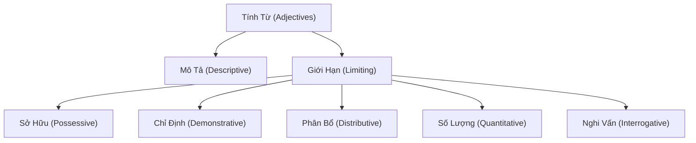

# Tính Từ (Adjectives)

> (Trang 51–69)

--- *Trang 51* ---

## Tính Từ (Adjectives)

1. Định nghĩa (Definition)
Tính từ (adjectives) là từ chỉ tính chất của người, vật, hoặc sự việc được biểu
thị bằng một danh từ hoặc đại từ.

II. Các loại tính từ (Kinds of adjectives)

Dựa trên Các tiêu chí khác nhau tính từ có thể được phân thành:

1. Tính từ mô tả và tính từ giới hạn (Descriptive adjectives and
limiting adjectives)

1.1. Tính từ mô tả (Descriptive adjectives): là tính từ được dùng để mô tả
hình dáng, kích thước, phẩm chất, đặc tính, màu sắc .. của người, vật
hoặc sự việc.

Ex: tall (cao), fat (mp), heavy (nặng), rich (giàu), old (già, cũ), new
(mới), less (thông minh), blue (mau xanh), beautiful (dep),
good (261), .

That man is a rich businessman.
(Người đàn ông đó là một thương gia giàu có.)
My school is small and old. (Trvường của tôi nhỏ và cũ.)

+ Tính từ mô tả chiếm phần lớn số lượng tính từ trong tiếng Anh.

1.2. Tính từ giới hạn (Limiting adjectives): là tính từ được dùng để đặt
giới hạn cho danh từ mà nó bổ nghĩa. Tính từ giới hạn gồm:

a. Từ xác định hoặc tính từ chỉ sự sở hữu (Possessive determiners/ adjectives):
được dùng trước danh từ để chỉ danh từ đó thuộc về id nao hoặc vật nào.

| Personal Pronouns | Possessive Determiner | Meaning |
|---|---|---|
| I | my | của tôi |
| you | your | của bạn / anh / chị |
| he | his | của anh ấy |
| she | her | của chị ấy |
| it | its | của nó |
| we | our | của chúng tôi |
| they | their | của họ, của chúng |

Ex: Have you seen my new coat?
(Bạn có thấy cái áo khoác mới của tôi không?)
Her father is a teacher. (Cha của cô ấy là giáo viên.)
The dog has just had its breakfast.
(Con chó vừa ăn xong bữa sáng của nó.)
b. Từ xác định hoặc tính từ chỉ định (Demonstrative determiners/ adjec-
tives) this, that, these, those, other, another, the other.
s This/ that + danh từ số it (singular noun)
These/ those + danh từ số nhiều (plural noun)

--- *Trang 52* ---

Ex: I like these earrings. Where did you get them?
(Tôi thích đôi hoa tai này. Bạn mua ở đâu vậy?)
That table is nice, isn’t it? ~ Yes, but I đơn’t like those chairs.
oy bàn đó đẹp, phải không? nh nhưng tôi không thích những cói
ghế đó.)

+ This/ these: chỉ người hay vật ở khoảng cách gần với người nói.

Ex: This little boy says he’s tired. (Thằng bé này nói là nó bị mệt.)
Come and see these photos. (Hãy đến xem những tấm hình này.)

+ That/ those: chỉ người hay vật ở khoảng cách xa.

Ex: Tell those men to go away. (Bảo những ga kia biến đi.)

Give me that hammer. (Pua tôi cây búa đó.)

- This, these, that, those thvường được dùng với danh từ chi thời gian. This/
these chỉ thời gian hiện tại hoặc khoảng thời gian sắp tới, that/ those
chỉ thời gian quá khứ hoặc khoảng thời gian xa hơn trong tương lai.
Ex: I'm taking my driving test this weekend, so I'm pretty busy these days.

(Cuối tvần này tôi sẽ thi lấy bằng lái, nên những ngày này tôi khá
bận rộn.)

Do you remember that summer we all went to Spain.

(Bạn có nhớ mùa hè ma tất cd chúng ta cùng đi Tây Ban nhà không?)

- This, these, that, those + danh từ + of + đại từ sở hữu có thể được dùng để
nhấn mạnh, thay cho tính từ sở hữu + danh từ.

Ex: This boy of yours seems very intelligent.

(Cậu con trai này của anh có vẻ rất thông minh.)

s Other + danh từ số ít/ số nhiều (singular/ plural noun): một hoặc nhiều
người, vật hoặc sự việc thêm vào cái đã được nêu lên hoặc ngụ ý trước đó.
Ex: In addition to Nicola, Mrs Stanley has three other children.

(Ngoài Nicola, bà Stanley còn có ba người con khóc.)

© Another + danh từ số it (singular noun): một người hoặc vật khác ngoài
cái đã có hoặc đã nêu.

Ex: I must find myself another job. (Tôi phải tìm công việc khác.)
She’s got another boy-friend. (Cô ấy đã có bạn trai khác.)

s The other + danh từ số ít: cái thứ hai trong hai cái.

Ex: The insurance office was on the other side of the street.

(Công ty bảo hiểm ở bên kia đvường.)

s The other + danh từ số nhiều: những người hoặc những vật còn lai;
phần còn lại.

Ex: When I returned home I found my wife talking to our neighbor. The
other guests had gone. (Khi vé nhà, tôi thấy vo tôi đang nói chuyện
với người hàng xóm. Những khách khác đã ra uề.)

Where are the other photos? (Còn những tấm hình khác đâu?)

c. Từ xác định hoặc tính từ phân bổ (Distributive determiners/ adjectives):
each, every, both, either, neither.

s Each/ Every + danh từ đếm được số it (singular countable noun): chỉ
nhóm người hoặc vật. Động từ theo sau ở số ít (singular verb).

--- *Trang 53* ---

Ex: Each room/ Every room has number. (Mỗi phòng đều có số.)
Trong nhiều trvường hợp, cả each va every đều có thể được dùng ma không
có sự khác biệt nhiều về nghĩa.
Ex: Each time/ Every time I see you, you look more beautiful.
(Mỗi lần tôi gặp bạn, trông bạn mỗi đẹp hơn.)
The police questioned each person/ every person in the bvuilding.
(Cảnh sát thẩm vấn từng người trong tòa nhà.)

Tuy nhiên each va every không hoàn toàn giống nhau

Each (mỗi) hàm ý mỗi người, mỗi vật hoặc mỗi sự vật trong một nhóm. Every
(mọi; mỗi) hàm ý tất cả người, vật hoặc sự vật được xem như một nhóm.
Ex: Every student in the class passed the examination.

(Mọi học sinh trong lớp đều thi đỗ.)

Each student has his/ her own place in the library.

(Mỗi học sinh có chỗ ngôi riêng của mình trong thư viện.)

Each được dùng khi nói về một số lượng nhỏ người hoặc vật. Every

thvường được dùng với một số lượng lớn.

Ex: I tried to phone her two or three times, but each time there was no reply.
(Tôi thử gọi cho cô ấy hai ba lần, nhưng không lần nao gọi được.)
Every time he phones, I always seem to be in the shower. [ = all the time]
(Duong như lần nào anh ấy gọi đến tôi cũng đang tắm.)

Each có thể được dùng để nói về hai người, hai vật hoặc sự vật.

Ex: In a football match, each team has 11 players.

(Trong một trận bóng đá, mỗi đội có 11 cầu thủ.) [NOT every-teara ..]
She had a child holding on to each hand.
(Cô ấy dắt mỗi tay một đứa trẻ.) [NOT .. eyery-hand]

Every được dùng để nói điều gì đó đã xảy ra thvường xuyên như thế nào.

Ex: There is a bus every ten minutes. (Mỗi 10 phút có một chiếc xe buýt.)
[NOT .. each ten-minutes]

Both (cd hai), either (cái/ người này hoặc cái/ người kia), neither

(không cái! người này hoặc không cái/ người kia): được dùng để chi hai

người, hai vật hoặc sự vật.

Both + danh từ đếm được số nhiều (plural countable noun)

Ex: Both books are interesting. (Cả hai cuốn sách đều hay.)

Either/ Neither + danh từ đếm được số ít (singular countable noun)

Ex: Neither answer is correct. (Cd hai câu trả lời đều không đúng.)
Come on Tuesday or Thursday. Either day is OK.

(Hãy đến vao thứ Ba hoặc thứ Năm. Ngày nào cũng được.)

. Từ xác định hoặc tính từ chỉ số lượng (Quantitative determiners/

adjectives) all, most, some, several, many, few, much, little, a lot of/ lots
of, no, one, twenty...

All (tất cả), most (phần lớn) + danh từ đếm được ở số nhiều (plural
countable noun) hoặc danh từ không đếm được (uncountable noun). Động
từ theo sau ở hình thức số nhiều hay số ít tùy thuộc vào danh từ.

--- *Trang 54* ---

Ex: All children need love. (Tất cả trẻ em đều cần tình thương.)
They had given up all hope. (Họ đã từ bỏ mọi hy vong.)
Most business meetings are held at the company’s main office.
(Hầu hết Các cuộc họp đều được tổ chức ở vin phòng chính của công ty.)
Most cheese is made from cow's milk.
(Phần lớn phó mát được lam từ sữa bò.)
Some (một vai, một số), any (nào) + danh từ đếm được ở số nhiều (plural
countable noun) hoặc danh từ không đếm được (uncountable noun).
Ex: There were some cornflakes on the table, but there wasn't any milk.
(Trên bàn có vai cái bánh bột ngô, nhưng không có sữa.)
Some thvường được dùng trong câu khẳng định va any thvường được dùng
trong câu phủ định và câu hỏi.
Ex: Some modern music sounds harsh and tuneless.
(Một số nhạc hiện đại nghe chói tai va không có giai điệu.)
Are there any stamps in the drawer?
(Có con tem nao trong ngăn kéo không?)
We bought some flowers, but we didn't buy any roses.
(Chúng tôi đã mua một ít hoa, nhưng chúng tôi không mua hoa hông.)
Some thvường được dùng trong câu đề nghị và câu yêu cầu.
Ex: Would you like some coffee? (Anh dùng chút cù phê nhé?)
ˆ Could you post some letters for me?
(Anh có thể gửi giúp tôi vai lá thư không?)
Some có thể được dùng với danh từ đếm được ở số ít để chỉ một người,
một nơi chốn, một vật chưa được biết đến hoặc chưa xác định.
Ex: Some man at the door is asking to see you.
(Ở ngoài cửa có người nào đó muốn gặp anh.)
She lives in some village in Yorkshire.
(Cô ấy sống trong một ngôi làng nào đó ở Yorkshire.)
Any có thể được dùng với danh từ đếm được ở số it trong câu khẳng định
để nhấn mạnh ý về chọn lựa tự do, với nghĩa “bất cứ ai; bất cứ cái gì,
điều gì.
Ex: Ask any doctor - They'll all tell you that alcohol is a poison.
(Hãy hỏi bất cứ bác sĩ nào - tất cd đều sẽ nói với bạn rằng rượu là
chất độc.)
I'm free all day. Call any time you like.
(Tôi rảnh rỗi suốt ngày. Hay gọi bất cứ lúc nào bạn muốn.)
No (= not any; not a: không ...nào) + danh từ đếm được số ít hoặc số
nhiều và danh từ không đếm được. Động từ theo sau ở số ít hoặc số nhiều
tùy thuộc vào danh từ.
Ex: I'm afraid I've got no money. (Tôi e rằng tôi chẳng có đồng nao.)
[= I haven't got any money.]
No rooms are available. (không có phòng trống.)
No student is to leave the room.
(Không một sinh viên nào được ra khỏi phòng.)

--- *Trang 55* ---

* Many, much, a lot of/ lots of: chỉ số lượng nhiều.
- Many va much thvường được dùng trong câu phủ định và câu nghi vấn.
Many + danh từ đếm được ở số nhiều (plural countable noun)
Much + danh từ không đếm được (uncountable noun).
Ex: There arent many customers in the store.
(Không có nhiều khách hàng trong cửa hàng.)
+ I haven't got much time for reading.
(Tôi không có nhiều thời gian đọc sách.)
Many va much được dùng trong câu khẳng định sau too, so, và as.
Ex: There are too many spelling mistakes in your writing.
(Có quá nhiều lỗi chính td trong bài viết của bạn.)
[NOT teo-a-lot-o lots-ef]
I've got so much work to do. (Tôi có rất nhiều việc phải làm.)
[NOT se-a-let-of-lets-ef]
Jane doesn’t have as many friends as her sister.
(Jane không có nhiều ban bằng chị cô.) [NOT as-alot—of]
& Lưu ý: Trong lối văn trịnh trọng, đôi khi chúng ta cũng có thể dùng many và much trong câu
khẳng định.
Ex Many students have financial problems. (nhiều sinh viên gặp khó khăn về tài chính.)
Many = a large number of, a good number of
Much = a great deal of, a good deal of, a large quantity of
- A lot of/ lots of thvường được dùng trong câu khẳng định.
A lot of/ lots of + danh từ đếm được ở số nhiều (plural countable noun)
hoặc danh từ không đếm được (uncountable noun)
Ex: A lot of people were quevuing for the film.
(Nhiều người đang xếp hàng mua vé xem phim.)
There was a lot of money in the safe. (Có nhiều tiền trong hét.)
A lot of lots of cũng có thể được dùng trong câu phủ định hoặc câu nghi
vấn trong lối văn thân mật.
Ex: I đơn’t have many/ a lot of friends. (Tôi không có nhiều bạn.)
Do you eat much/ a lot of frvuit? (Ben có ăn nhiều trái cây không?)
Luu ý: Không dùng a lot of sau too, so, as va very.
Ex. Sarah has so many friends. (Sarah có rất nhiều ban.) [NOT so-a-1ot of]
s (a) few va (a) little: chi số lượng nhỏ.
- A few va a little (một vai; một số) mang nghĩa khẳng định.
A few + danh từ đếm được ở số nhiều (plural countable noun)
A little + danh từ không đếm được (uncountable noun)
Ex: I enjoy my life here. I have a few friends and we meet qvuite often.
(Tôi sống ở đây rất vvui. Tôi có vai người ban va chúng tôi gặp nhau
khá thvường xuyên.) [a few friends = some friends]
Lets go and have a drink. We've got a little time before the train leaves.
(Chúng ta đi uống nước di. Chúng ta vẫn còn một it thời gian trước
khi tàu chạy.) [a little time = some time]

--- *Trang 56* ---

— Few va little (it) mang nghĩa phủ định, hàm ý ‘không nhiều như mong
đợi/ như người ta nghĩ.
Few + danh từ đếm được số nhiều
Little + danh từ không đếm được
Ex: He isn’t popular. He has few friends. (Anh ta không được mọi người
yêu thích. Anh ta có ít bạn bè.) [few friends = not many friends]
We must be qvuick. There is little time. (Ching ta phdi nhanh lén.
Không có nhiều thời gian đâu.) [little time = not much time]
- Very little va very few cũng có thể được dùng.
Ex: We must be qvuick. There is very little time.
(Chúng ta phải nhanh lên. Có rốt ít thời gian.)
» So sánh hai câu sau:
- He spoke little English, so it was difficult to talk to him.
(Anh ta nói được ít tiếng Anh, nên nói chuyện với anh ta thật khó khăn.)
[little English = not much English]
~ He spoke a little English, so we can talk to him.
(Anh ta nói được một it tiếng Anh, nên chúng ta có thể nói chuyện
với anh ta.) [a little English = some English]
J Luu ý: ‘only a little’ và ‘only a few’ có nghĩa phủ định.
Ex. We must be qvuick. We've only got a little time.
(Chúng ta phải nhanh lên. Chúng ta chỉ có một ít thời gian.)
[only a little time = not much time]
The village was very small. There were only a few houses.
(Ngôi làng rất nhỏ. Chỉ có một vài ngôi nhà.) [only a few houses = not many houses]
e. Từ xác định hoặc tính từ nghỉ vấn (Interrogative determiners/ adjectives)
whose, what, which.
s Whose + danh từ đếm được hoặc không đếm được (countable/ uncountable
noun)
Ex: Whose cars are those outside? (Nhiing chiếc xe bện ngoài kia là của ai vậy?)
‘Whose money did you buy the car with?
(Anh mua xe bằng tiền của ai vậy?)
s What + danh từ đếm được hoặc không đếm được (countable/ uncountable
noun).
Ex: What famous person said this?
(Nhân uật nổi tiếng nao đã nói điều nay thế?)
What color are the baby’s eyes? (Mdt bé mau gì?)
s Which + danh từ đếm được hoặc không đếm được (countable/ uncountable
noun)
Ex: Which secretary sent the fax? (thư ky nào đã gửi bản fax nay?)
Which color do you want — green, red, yellow or brown?
(Bạn thích mau nào - xanh, đỏ, vang, hay nâu?)
Lưu ý:
— Which và what thvường được dùng để hỏi về vật. Nhưng khi đứng trước danh từ, which
va what có thể được dùng để hỏi về người.

--- *Trang 57* ---

Ex Which/ What doctor did you see? (Anh đã gặp bác sĩ nào vậy?)
~ Which va what thvường có thể được dùng không có sự khác biệt nhiều về nghĩa.
Ex. Which/ What train will you catch? (Anh sẽ đón chuyến xe lửa nào?) .
Which/ What writers do you like? (Bạn thích những nhà văn nào?)
Tuy nhiên which thvường được dùng khi người nói nghĩ đến hoặc đưa ra một số lượng giới
hạn để chọn lựa.
Ex. Which size do you want - small, medium or large?
(Chị muốn kích cỡ nào - nhỏ, vừa hay lớn?)
Which phone shall | use, this one or the one in the office?
(Tôi nên dùng điện thoại nào, cái này hay cái trong văn phòng?)
Khi người nói không nghĩ đến số lượng giới hạn thi dùng what.
Ex What sport do you play? (Anh chơi môn thể thao nào?)
[tennis, or golf, or football, or hockey, or ...?]
What language do they speak in Greenland? (Ở Greenland người ta nói tiếng gì?)
[English, or Spanish, or Japanese, or Arabic, or...?]
2. Tính từ thuộc ngữ va tính từ vị ngữ (Attributive adjectives and
predicative adjectives)

2.1. Tính từ thuộc ngữ (attributive adjectives) là tính từ đứng trước danh

từ mà nó mô tả.
Ex: Hes a nice man. (Ông ấy là người tốt.)
2.2. Tính từ vị ngữ (predicative adjectives) là tính từ theo sau Các hệ từ be,
become, feel, look, get, seem,...
Ex: She were asleep. (Cô ấy dang ngủ.)
3. Tính từ đơn và tính từ ghép (Simple adjectives and compound
adjectives)
8.1. Tính từ đơn (simple adjectives) là tính từ chi có mat từ.
Ex: beautiful (xinh dep), good (tốt), sad (buồn...

8.2. Tính từ ghép (compound adjectives) là tinh wr được thành lập bằng
cách kết hợp hai hoặc nhiều từ lại với nhau và được dùng như một tính
từ duy nhất. Tính từ ghép có thể được viết:

- thành một từ duy nhất.

Ex: life + long = lifelong (suốt đời, lâu dài)
home + sick = homesick (nhớ nhà, nhớ qvề hương)

- thành hai từ và có dấu gạch nối (-) ở giữa.

Ex: duty-free (miễn thuế) world-famous (nổi tiếng khắp thế giới)
* Tính từ ghép có thể được tạo thành bởi:

- Danh từ + tính từ (noun + adjective)

Ex: seasick (say sóng) blood-red (đỏ nhu máu)
world-weary (chán đời, chán sống) lifelong (suốt đời, lâu dai)

- Tính từ + danh từ (adjective + noun)

Ex: long-distance (đvường dài) second- rate (hạng nhì, loại thvường)

- Danh từ + phân từ (noun + present/ past participle)

--- *Trang 58* ---

Ex: man-made (hân tạo) machine-wound (qudn bằng máy)
heart-breaking (lam dau long) time-consuming (tốn thời gian)
- Tính từ + phân từ (adjective + present/ past participle)
Ex: ready-made (Jàm sẵn, may sẵn) clear-cut (rõ ràng)
easy-going (thoải mái, dễ chịu) fine-looking (trông đẹp mắt)
- Trạng từ + phân từ (adverb + present/ past participle)

Ex: well-known (nổi tiếng) outspoken (trực tinh)
hard-working (cần cù) everlasting (đời đời, bất diệt)
- Tính từ + tính từ (adjective + adjective)
Ex: white-hot (rất nóng) absent-minded (đãng tri)

worldy-wise (từng trdi, lõi đời)
~ Tính từ + danh từ + ED (adjective + noun + ED)
Ex: white-livered (nhát gan, nhút nhát)
long-sighted (vién thi) good-humored (vvui tinh, dé dai)

II. Phân từ dùng như tính từ (Participles functioning as adjectives)

Hiện tai phân từ (present participle — V-ing) và quá khứ phân từ (past
participle — V-ed/V,) có thể được dùng như một tính từ trước danh từ hoặc
sau động từ to be và Các hệ từ khác.

1. Hiện tại phân từ (present participle) được dùng để mô tả người, vật
hoặc sự việc tạo ra cảm xúc — nghĩa chủ động.

Ex: Jane's job is boring. (Công việc của Jane thật tẻ nhạt.)
[It makes Jane bored.]
Tom was very interesting person. (Tom là một người rất thú vi.)
[He made us interested.]
His idea seems exciting. (Ý biến của anh ấy có vé rốt hay.)
[It makes us excited.]

2. Quá khứ phân từ (past participle) được dùng dé mô tả trạng thái hoặc
cảm xúc của một người (đối với người, vật hoặc sự việc nào đó) > nghĩa thụ
động (bị tác động).

Ex: Jane is bored (with her job). (Jane chán công việc của mình.)
Boring teachers make bored students. (Thầy buồn té khiến trò chán.)
His explanation made me very confused.
(Lời giải thích của anh ta làm cho tôi rất bối rối.)
She's an interesting writer, and I'm very interested in the subjects
that she writes about.
3 (Bà ấy là một nhà van thú vi, tôi rất thích những dé tai ba ấy viết.)
Lưu ý:
—  Cach thành lập phân từ:

+ Hiện tại phân từ (present participle) được thành lập bằng cách thêm -ing vào sau dang

nguyên mẫu của động từ: interesting, boring, exciting, developing, ...

+ Quá khứ phân từ (past participle) được thành lập bằng cách thêm -ed vào sau Các

động từ có quy tắc. Quá khứ phân từ của Các động từ bất quy tắc là động từ nằm ở cột
3 trong bảng động từ bất quy tắc: interested, bored, excited, broken, grown, forgotten,...

--- *Trang 59* ---

— Mot số nội động từ (intransitive verbs) có dạng quá khứ phan từ có thể được dùng như
tính từ với nghĩa chủ động, nhất là khi đứng trước danh từ.

Ex a fallen leaf (chiếc lá rung) [= a leaf that has fallen]
developed countries (Các nước phát triển) [= countries that have developed]

IV. Danh từ dùng như tính từ (Nouns functioning as Adjectives)
Trong tiếng Anh, danh từ có thể được dùng như tính từ để bổ nghĩa cho
danh từ khác. Các danh từ này thvường đứng trước từ mà nó bổ nghĩa và
luôn ở dạng số ít (singular form).
Ex: We need some new garden tools.
(Chúng ta cần một số dụng cụ lam uvườn mới.)
That shoe shop's closed down. (Tiệm giày đó đã đóng cửa luôn rồi.)
[NOT That-shoes-shop ...]
It’s vegetable soup. (Đó là món súp rau.) [NOT ... vegetables—soup]
Khi danh từ được dùng như từ bổ nghĩa kết hợp với một con số thì danh từ
luôn ở hình thức số ít (ngay khi chúng bổ nghĩa cho danh từ số nhiều) và có
dấu gạch ngang giữa danh từ và con số.
Ex: We took a tour that lasted five weeks. (noun)
— We took a five-week tour. (adjective)
(Chúng tôi đã đi một chuyến du lịch kéo dai 5 tvần.)
That student wrote two reports that was ten pages long each.
— That student wrote two ten-page reports.
(học sinh đó đã viét hai bai tvường trình mỗi bai dài 10 trang.)
Her son is five years old.
— She has a five-year-old son. (Cô ấy có một đứa con trai 5 tuổi.)
V. Vị trí của tính từ (Position of adjectives)
1. Vị trí thuộc ngữ và vị trí vị ngữ (Attributive and predicative position)
1.1. Vị trí thuộc ngữ (attributive position): đứng trước danh từ.
Ex: The new secretary doesn’t like me. (Người thư ky mới không thích tôi.)
He is an intelligent student. (Anh ta là một học sinh thông minh.)
1.2. Vị trí vị ngữ (predicative position): đứng sau Các hệ từ (linking verbs)
be (thi), seem (có vé, dvường như), look (trông có vẻ), become (trở nên), get
(trở nên), feel (cảm thdy), sound (nghe có vé), taste (có vi), smell (có mùi),
appear (hình như, có vé).
Ex: The children seemed happy. (Trông bọn trẻ có vé rất uvui.)
This dress is new, isn't it? (Chiếc áo đầm này mới, phải không?)
It’s getting cold. (Trời đang trở lạnh.)
She appeared very confident. (Cô ấy có vẻ rất tự tin.)
J Lưu ý: Phần lớn tính từ đều có thể đứng ở cả hai vị trí - trước danh từ và sau hệ từ (linking
verbs - be, seem become, look, get, ..)
Ex He's a rich businessman. (Ông ấy là một thương gia giàu có.)
Or. He's very rich. (Ông ấy rất giàu.)
Claire's got a new car. (Claire có xe hơi mới.)
Or. Claire's car is new. (Xe hơi của Claire thì mới.)

--- *Trang 60* ---

Nhưng có một số tính từ chỉ có thể được dùng ở một vị trí trong câu:

— _ Một số tính từ chỉ có thể đứng trước danh từ như: main (chính), chief (chính, chủ yếu),
indoor. (trong nhà), outdoor (ngoài trời), elder (hơn tuổi, lớn hơn), eldest (lớn tuổi nhất),
only (duy nhất), former (trước, cũ), upper (bên trên), outer (bên ngoài).

Ex. Be careful crossing the main road. (Hãy cẩn thận khi băng qua con đvường chính.)
The only problem is I've got no money. (Van để duy nhất là tôi không có tién.)

— Mot số tính từ chỉ có thể được dùng sau hệ từ (linking verbs):

+ Tính từ bắt đầu bằng a- asleep (đang ngủ), afraid (sợ), alike (giống nhau), awake
(thức), alone (một mình), alive (còn sống), ashamed (hổ thẹn), afloat (nổi), aware (hiểu),
alight (cháy).

+ Tính từ khác: ill (6m đau), well (khỏe), content (hài lòng), unable (không có khả năng),
fine (khỏe), glad (vvui mừng), upset (làm khó chịu), exempt (miễn tr).

Ex The baby is asleep. (Em bé đang ngủ.)

but: a sleeping baby (một em bé đang ngủ) [NOT an-asleep-baby]

Vicky looked ill. (Vicky có vẻ đang bệnh.)

but: Nurses look after sick people. (Y tá chăm sóc người bệnh.) [NOT i-people]
He was afraid. (Anh ta hoảng sợ.)

but: frightened children. (những đứa trẻ hoảng sợ) [NOT araid-ebildren]

2. Tính từ thuộc ngữ đứng sau danh từ (Attributive adjectives after nouns)
Tính từ có thể đi sau danh từ mà nó bổ nghĩa trong Các trvường hợp sau:
a. Tính từ được dùng để bổ nghĩa cho Các đại từ bất định: something, anything,

nothing, everything, someone, anyone, somewhere, v.v.

Ex: Did you meet anyone interesting at the party?

(Tại bữa tiệc đó anh có gặp người nào lam cho anh chú ý không?)
Let's go somewhere qvuiet. (Chúng ta hãy đến nơi nào đó yên tĩnh đi.)
I have something important to tell you.
(Tôi có việc này quan trọng muốn nói với bạn.)
b. Tính từ được dùng trong Các cụm từ diễn tả sự đo lvường (chiều dài, chiều
cao, tuổi tác,..).
Ex: This table is two meters long. (Cái bàn này dai 2 mét.)
The lake is five meters deep. (Hồ sâu 5 mét.)
My daughter is six years old. (Con gái tôi 6 tuổi.)
c. Hai hoặc nhiều tính từ được nối với nhau bằng and hoặc but va cùng bổ
nghĩa cho một danh từ.
Ex: He is a writer both witty and wise.
(Ông ta là một nhà van vita di dém vita lịch duyệt.)
d. Tính từ tận cùng bằng -able và -ible. (Tính từ này cũng có thể đứng
trước danh từ.)

Ex: The dish is made with ingredients available in most supermarkets.
(Món ăn này được làm bằng Các thành phần có thể mua được tại hầu
hết Các siêu thị.)

It's the only solution possible. (Đó là giải pháp duy nhất có tính khả thi.)
Td like to speak to person responsible.
(Tôi muốn nói chuyện với người có trách nhiệm.)

--- *Trang 61* ---

3. Động từ + tân ngữ + tính từ (Verb + object + adjective)
Một vi tri khác nữa của tính từ là đứng sau tân ngữ trong cấu trúc
động từ + tân ngữ + tính từ.
Ex: The students made their teacher angry.
(học sinh làm thầy giáo nổi giận.)
Lets paint the kitchen yellow.
(Chúng ta hãy sơn nhà bếp mau vang di.)
We should keep our room clean and tidy.
(Chúng ta nên giữ phòng sạch sé va ngăn nắp.)

VI. Trật tự của tính từ đứng trước danh từ (Order of adjectives before nouns)
Chúng ta có thể dùng hai hoặc nhiều tính từ trước một danh từ để bổ nghĩa
cho danh từ đó.

Ex: She lives in a nice new house on the hill.
(Cô dy sống trong ngôi nhà mới xinh dep trên ngọn đôi này.)
There is a beautiful large round wooden table in the kitchen.
(Trong nhà bếp có một cái bàn gỗ tròn, to và đẹp.)
Các tính tit “new, round, wooden, large’ là tính từ miêu tả. Chúng cho ta
những thông tin về kích thước, hình dáng, tuổi tác, chất liệu, v.v. Các tính
từ ‘nice, beautiful’ là tính từ chi quan điểm. Chúng cho biết cảm nghĩ khách
quan của người nói. — Tính từ chỉ quan điểm thvường được dùng trước tính
từ miêu tả.

* Trật tự của Các tính từ
Khi có hai hoặc nhiều tính từ đứng trước danh từ thì trật tự thvường (nhưng
không phải luôn luôn) được sắp xếp theo thứ tự sau (từ trên xuống)

1. Determiners
2. Cardinal adjectives
3. Opinion (how good?)
4. Size (how big?)

5. Quality

a, the, this, my, those, some, several, ...
one, four, ten, ..

big, small, long, large, short, tall, fat...

qvuiet, boring, shiny, important, famous, angry, wet,
sunny, fast, difficult, warm, wise, modern...

new, old, young, elderly, ...

7. Shape round, oval, triangular,...

8. Colour red, blue, brown, green, black, ...

9. Origin (where from?) | Japanese, American, Chinese, ...

10. Material (made of?) | stone, plastic, steel, paper, leather, ...

11. Type (what kind?) | an electric kettle, political matters, ...

12. Purpose (what for?) | a bread knife, walking stick, riding boots, bath tower, ..

6. Age (how old?)

Ex: Who's that fat old lady over there? (Ba lão mộp map kia là ai vay?)
[NOT thet-eld-fat-lady]

--- *Trang 62* ---

She bought two beautiful wooden picture frames.

(Cô ấy đã mua hai khung hình bằng gỗ rất dep.)

[opinion, material, purpose]

That poor man used to live in a big, modern brick house.

(Người đàn ông nghèo khổ đó đã từng sống trong một ngôi nhà gach
lớn và hiện đại) [size, quality, material]

Ann has a small round pink face.

(Ann có gương mặt tròn, nhỏ hồng hào.) [size, shape, colour]

Please give me that old green plastic bucket.

(Pua giúp tôi cái xô nhựa cũ màu xanh kia.) [age, colour, material]
These red Spanish leather riding boots belong to Tom.

(Đôi ủng cưỡi ngựa bằng da, màu đỏ được sản xuất tại Tây Ban nhà
này là của Tom.) [colour, origin, material, purpose]

Lưu ý:

Ex.

g'

Tính từ chỉ kích thước và chiều dài (big/ small/ tall/ long/ short...) thvường đúng trước
tính từ chỉ hình dáng và chiểu rộng (round/ oval/ fat/ thin/ wide/ narrow/...

a tall thin girl (một cô gái cao gầy)

a long narrow street (một con đvường dài và hẹp)

Tính từ chỉ thứ tự (ordinal adjectives - first, second, third,..) đứng trước tính từ chỉ số
lượng (cardinal adjectives - one, two, three, ..)

Ex the first two days (Hai ngày đầu tiên) [NOT the-twe-first-days]

Nếu Các tính từ cùng loại, thi tính từ ngắn thvường được đặt trước tính từ dài.

¢ It was a cold windy day. (Đó là một ngày gió lạnh.)

Basil was a tall well-bvuilt man. (Basil là một người cao to lực lưỡng.)
Khi có hai hoặc hơn hai tính từ chỉ màu sắc, ta dùng liên từ and.

ca black and white dress (một cái áo đầm màu đen và trắng)

a red, white and green flag (một lá cờ đỏ, trắng và xanh)

VII. Tính từ được dùng như danh từ (Adjectives used as nouns)
Một số tính từ có thể được dùng với the để nói về một nhóm người trong xã
hội, nhất là những nhóm người có tình trạng thể lực hoặc hoàn cảnh xã
hội đặc biệt.
Ex: the blind (nhizng người mù), the poor (những người nghèo), the old

(những người gia), the deaf (những người diéc), the disabled (những
người tan tat), the sick (những người bệnh), the under-fives (những
đứa trẻ dưới 5 tuổi), the unemployed (những người thất nghiệp)...
The gap between the rich and the poor is on the increase.
(Khoảng cách giữa người giàu va người nghèo ngày càng tăng.)
The young are usually keen to travel.

(Thanh nién thuong thich di du lich.)

Các cụm từ này có nghĩa số nhiều (the unemployed = all unemployed people)
nên đi với động từ và đại từ số nhiều.
Ex: The unemployed are losing their hope.

(Những người thất nghiệp đang mdt dần hy uọng.)

--- *Trang 63* ---

- The + adjective đôi khi còn được dùng để đề cập đến những khái niệm

trừu tượng.
Ex: the good (cái thiện) the beautiful (cái dep)
the evil (cái ác) the supernatural (hign tượng siêu nhiên)

He is a lover of the beautiful. (Ong ta là người yêu cái đẹp.)
Are you interested in the supernatural?
(Anh có quan tâm đến hiện tượng siêu nhiên không?)

* Luu ý:

— The + tính từ (the + adjective) chỉ được dùng để nói đến một nhóm người với nghĩa
tổng quát. Nếu chúng ta muốn để cập đến một nhóm người cụ thể nào đó, ta phải dùng
thêm danh từ (people, person, man, woman,...)

Ex The young are usually keen to travel. (Thanh niên thvường thích đi du lịch.)

None of the young people in the village can find jobs here.
(Không một thanh niên nào trong làng tìm được việc làm ở đây.)

- không dùng sở hữu cách “s với Các cụm từ này.

Ex: the problems of the poor OR poor people's problems
[NUT epoope problems]

— bi khi chúng ta có thể dùng tính từ không có the sau Các lượng từ như many va more,
trong cấu trúc cặp đôi and và or, và sau sở hữu cách.

Ex There are more unemployed than ever before.

(Chua bao giờ người thất nghiệp lại nhiều như hiện nay.)
They provided opportunities for both rich and poor.
(Họ tạo cơ hội cho cả người giàu lẫn người nghèo.)

» EXERCISES

I. Underline all the adjectives in this description.
This comfortable hotel with its pleasant gardens is ideal for people who want a qvuiet
holiday, yet it is only a short distance from the highly popular attractions of the
area. There are lovely views from every room. The atmosphere is very friendly, and
the staff are always helpful. The holiday here is very good value for money.
You can eat your meals at the hotel, where the food tastes marvellous. Or you can of
course try some of the excellent local restaurants.

H. Complete the sentences for each situation. Use the word given + the ending -ing or -ed
1. The film wasn’t as good as we had expected. (disappoint)
a. The film was b. We were with the film.
2. Diana teaches young. children. Its a very hard job but she enjoys it. (exhaust)
a. She enjoys her job but it’s often -
b. At the end of a day's work, she is often
8. It’s been raining all day. I hate this weather. (despress)
a. This weather is . b. This weather makes me
c. It’s silly to get because of the weather.

--- *Trang 64* ---

10.

11.
12.
13.
14.
15.

16.
17.
18.
19.
20.

^ 6B.

. Clare is going to the United States next month. She has never been there before.

(excite)

a. It will be an experience for her.

b. Going to new places is always -

c. She is really about going to the United States.

Jane doesn’t enjoy her job any more and would like to do something different. (bore)
a. Jane is with her job because she does the same thing every day.

b. Jane's job is so

Choose the correct word.

Are you interesting/ interested in football?

. The football match was qvuite exciting/ excited. I enjoyed it.

It’s sometimes embarrassing/ embarrassed when you have to ask people for money.
Do you easily get embarrassing/ embarrassed?

Thad never expected to get the job. I was really amazing/ amazed when I was offered it.
She has really learned very fast. She has made astonishing/ astonished progress.

I didn’t find the situation funny. I was not amusing/ amused.

. It was a really terrifying/ terrified experience. Afterwards everybody was very shock-

ing/ shocked.

Why do you always look so boring/ bored? Is your life really so boring/ bored?
He's one of the most boring/ bored people I've ever met. He never stops talking and
he never says anything interesting/ interested.

The two-hour delay was annoying/ annoyed.

This weather makes me so depressing/ depressed.

Going for a jog with Matthew is exhausting/ exhausted.

This computer has some very confusing/ confused instructions.

‘When I got onto the roof. I felt frightening/ frightened.

The journey took all day and night. They found it very tired/ tiring.

1 thought the program on wildlife was fascinating/ fascinated.

The children always get exciting/ excited when the Granny comes.

What thrilling/ thrilled news this is! Congratulation!

I'must say it made me puzzling/ puzzled. I just đơn’t understand.

Complete the sentences, using one of the following words.

bored/ boring confused/ confusing
interested/ interesting excited/ exciting

amused/ amusing surprised surprising
exhausted/ exhausting ơnnoying/ annoyed

He works very hard. It’s not surprising that he’s always tired.

. The teacher’s explanation was „ Most of the students didn’t understand it.

I seldom visit art galleries. I'm not particularly in art.
The lecture was . I fell asleep.

--- *Trang 65* ---

5. Liz is always late. I'll be if she gets here on time.
6. I've been working very hard all day and now I'm
7. Tm starting a new job next week. I'm qvuite about it.
8. Tom is very good at telling funny stories. He can be very 1
9. There is no need to get just because I'm a few minutes late.
10. Liz is a very person. She knows a lot, she’s traveled a lot and she’s done lots
of different things.
V. Complete the conversation, using the word ending in -ing or -ed.
Vicky : That was an (1). (excite) film, wasn’t it?
Rachel: Oh, do you think so? I'm (2) (surprise) you liked it. I thought it was
rather (3). (disappoint)
Vicky : Well, I was (4). (puzzle) once or twice. I didn’t understand the whole
story. It was (5). (confuse) in places. But the end was good.
Rachel: Iwas (6). (bore) most of the time. I didn’t find it very (7). (interest)
VI. Complete the conversations using a word ending in -ing or -ed.
1. A: Imsurprised how warm it is for March.
B: Yes, all this sunshine is qvuite surprising .
2. A: I'm not very fit. I was pretty tired after climbing the mountain.
B: Yes, I think everyone felt
3. A: IthinkI need to relax.
B: Well, lying by the pool should be
4. A: It was annoying to lose my ticket.
B: You looked really when you had to buy another one.
5. A: The cabaret was amusing.
B: Claire was certainly. She couldn’t stop laughing.
6. A: The museum was interesting, wasn’t it?
B: It was OK. I was qvuite in those old maps.
7. A: I'm fascinated by these old photos.
B: Ialways find it to see what people looked like as children.
8. A: Was it a big thrill meeting Tom Hanks?
B: You bet. It was just about the most moment of my life.
9. A: You look exausted. You should go to bed.
B: Driving down from Scotland was pretty
10. A: I think the way Jessica behaved was qvuite shocking.
B: Yes,Iwasso_ that] couldn't say a word.
VII. Put the adjectives in brackets in the correct position.
1. .a table (wooden/ round) a round wooden table

2. avase (glass/ old/ lovely)
3. a pullover (green/ new)
4. abox (metal/ black/ small)

--- *Trang 66* ---

a basin (sugar/ antique/ silver)
shoes (black/ leather/ big)

adress (new/ blue/ nice)

a mirror (wall/ attractive)

a seat (wooden/ expensive/ garden)
10. a painting (French/ interesting/ old)
11. a singer (opera/ famous/ Italian)

12. hair (black/ straight/ long)

13. stamps (postage/ valuable/ Australian)
14. chairs (kitchen/ red/ metal)

15. a boat (model/ splendid/ old)

16. a journey (boring/ train/ long)

17. some questions (easy/ nice/ qvuiz)

18. a day (sunny/ beautiful)

19. an avenue (long/ wide)

20. a cat (fat/ black/ yellow/ big)

VIII. Write the information in a single sentence.
1. This game is new. It’s for the family. And it’s exciting.

s ø xe a

This computer is for business. It's Japanese. And it’s powerful.

This fire is electric. It's excellent. And it’s small.

This is a chocolate bar. It’s new. And it’s a big bar.

This comedy is American. It’s for television. And it’s terrific.

These doors are aluminium. They're for your garage. And they're stylish.
Those shoes are modern. They're for sports. And they're wonderful.
This phone is a mobile. It's German. And it’s very good.

IX. Complete each sentence with a verb (in the correct form) and an adjective.
Verbs: smell, look (2), feel, seem, taste, sound, become (2), get
Adjectives: awful, fine, nice, interesting, violent, wet, upset, boring, hungry, terrible

®Ne VY

1. Ican't eat this. I've just tried it and it _tastes awful .

2. I wasn't very well yesterday but I today.

3. What beautiful flowers! They too.

4. You „ Have you been out in the rain?

5. As the film went on, it more and more ___. Therefore I fell asleep during
the film.

6. Jim was telling me about his new job. It __ qvuite „ much better than his old job.

7 Ann_ this morning. Do you know what was wrong?

8. Why đơn’t we go for dinner? I

9. You ! Are you all right?

10.Theman __ when the manager of the restaurant asked him to leave.

--- *Trang 67* ---

X. Complete the second sentence so that it has the same meaning to the first, using
the structure noun + noun.

1. Her call to California lasted ten minutes.
She made a _ten-minute call to California. ,

2. Sam's new apartment is in a bvuilding which has twelve storeys.
Sam’s new apartment is in a

3. We teach languages.

We are
nh patois hava play 11”
My parents saw a last night.

5. The manager said that the sale would last for two days.
The manager said that it would be a

6. Mark bought a tool set containing 79 pieces.
Matkboughtag —_— _.. ..

7. Ineed two cans of tomatoes that weigh 16 ounces each.
I need two —— IL: VS

8. I'm looking for a pressure cooker that holds six quarts.
I'm looking for a

9. Heis a specialist at bvuilding houses made of bricks.
He is a specialist at bvuilding

10. Mrs Brown just bought her daughter a bicycle with at speeds.
Mrs Brown just bought her daughter a

XI. Put in each or every.
There were four books on the table. Each book was a different colour.
guest watched as the President came in.
There were cars parked along side of the street.
My father plays tennis Thursday evening.
I understood most of what they said but not word.
of the six flats has its own entrance.
We had a great weekend. I enjoyed minute of it.
The book is divided into five parts and _ of these has three sections.
Car seat belts save lives. driver should wear one.
10. day seemed to pass very slowly.

XI. Complete the conversation. Put in every, each, whole, both, either or neither.

Assistant : These plain sofas come in two different styles.

Sarah : I'think (1)____ styles are rather old-fashioned. (2)____ of them is really
what I want. I đơn't like (3) of them, I'm afraid.

Assistant : What about a patterned fabric? There are some lovely colour here.

Sarah  : I feel more and more unsure with (4)__ new fabric I look at.

Mark : We haven't have time to look at (5). fabric in the shop. We've been
inherea(6)_ hour already, you know.

POAT ALD

--- *Trang 68* ---

XIM. Put in a /of of, much or many.

We didn’t spend much money on holiday.

Ron Mason owns a chain of supermarkets. He's made money.

I đơn’t know people in this town.

We are having a big party. We've invited friends.

I feel really tired. I haven't got energy.

There are no need to hurry. We've got time.

She's got too relatives!

They've got so money that they đơn’t know what to do with it.

Are there opera houses in London? ~ Not , but there are

theatres and cinemas.

10. Do you have trouble with English? ~ I đơn’t have
but T have difficulty writing.

XIV. Little or a little? Few or a few?
I can’t lift this box on my own. I need alittle help.
Anne is very busy these days. She has free time.
The postman doesn’t often come here. We receive letters.
Sandra is exhausted. She’s having days’ holiday next week.
Trevor isn’t finding it easy to fix the shelves. He’s having trouble.
Icanspeak words of Swedish, but I'm not very fluent.
David qvuite likes golf, but he has ability.

—— tourists visited Northern Ireland in the 1980s because of the terrorism there.
Vicky has made progress and so is feeling qvuite pleased.
10. We'd better hurry. Our bus goes in minutes.

XV. Put in much, many, few, a few, little, a little.
1. Did you take

. Pm not very busy today. I haven't got to do.
. The museum was very crowded. There were too

œ œ4 Ø pmhự LN

trouble speaking,

ENO mg. ©b

photographs when you were on holiday?

2

3. people.
4. The weather has been very dry recently. We've had rain.
5. Listen carefully. I'm going to give you advice.

6.

7,

8

9

„ Do you mind if I ask you questions?

I need some money. Have you got any? — Yes, but not
. .Would you like milk in your coffee? ~Yes, please.
. Have you ever been to Paris? ~Yes, I've been there times.
old bvuildings.

10. Most of the town is modern. There are

11. The boys are making too noise.

12. How languages can you speak? Anh how
learning English?

13. There was traffic, so the journey didn’t take very long.

14. The island is very small and does nothave ____ residents. The islanders donot have ___
monev. and thev have contact with the outside world.

time do you spend on

--- *Trang 69* ---

15. My home town is not a place attracting tourists. Thereare shops, and there is
entertainment.

XVI. Each of the sentences has a mistake in it. Write the correct sentence.
1. Are you going on holiday that year?

That was a very good idea of you.

You've got a lot books, haven't you?

I đơn’t know the meeting's time.

Nigel has hurt the leg.

All rooms in the house were cold.

Every of the four doors was locked.

1 live my life, and my sister lives her.

The both socks have got holes in them.

10. Here's a copy of this week magazine.

11. This sweater is losing it’s color.

12. I want some paper, but there’s no in here.

13. Mark was only spending one night away. He qvuickly put a little things into a bag.
14. I take photos, but not as lots of as I used to.

15. There were cars parked along each street in town.

XVII. Write a second sentence so that it has a similar meaning to the first. Use the word
in brackets.

When I was on holiday, it rained all week. (whole)

When I was on holiday, it rained the whole week.

I've lived here more than half my life. (most)

Your house is bigger than our house. (ours)

Tve forgotten my doctor's name. (of)

We haven't had much warning of the changes. (little)

Such a large number of people have applied for the job. (so)
1 met one of your old friends at a party. (an)

Both the chairs are uncomfortable. (neither)

All the hotels were full. (every)

10. My holiday starts ten days from now. (time)

® 9 Z4 A PC l9

CENSOR eo |