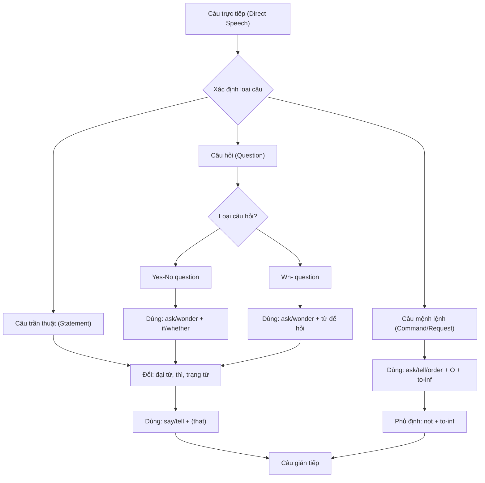

# Lời Nói Gián Tiếp

> (Trang 318–333)

--- *Trang 318* ---

I. Lời nói trực tiếp và lời nói gián tiếp (Direct and indirect speech)

C6 hai cách để thuật lại những gì mà một người nào đó đã nói: trực tiếp và
gián tiếp.

1. Lời nói trực tiếp (direct speech) là sự lặp lại chính xác những từ của
người nói.

Ex: Bill said, ‘I don’t like this party.”
(Bill nói, “Tôi không thích bữa tiệc nay.”)
- Lời nói trực tiếp được đặt trong dấu ngoặc kép và sau động từ chính có
dấu phẩy (,) hoặc dấu hai chấm (;).
- Đôi khi mệnh đề chính cũng có thể đặt sau lời nói trực tiếp.
Ex: ‘I don’t like this party,’ Bill said.

2. Lời nói gián tiếp (indirect/ reported speech) là lời tường thuật lại ý của

người nói, đôi khi không cần phải dùng đúng những từ của người nói.
Ex: Bill said (that) he didn’t like that party.
(Bill nói rằng anh ấy không thích bữa Hệc đó.)

II. Câu trần thuật trong lời nói gián tiếp (Statements in indirect speech)
Khi chuyển một câu trần thuật từ trực tiếp sang gián tiếp, chúng ta cần lưu
ý đến những thay đổi sau:

1. Dùng động từ giới thiệu say hoặc tell: say that; say to somebody that; tell
somebody that. Động từ giới thiệu trong lời nói gián tiếp thường ở quá khứ
và liên từ that có thể được bỏ.

Ex: Tom said (that) he was feeling ill. (Tom nói anh ấy thấy không khỏe.)
I told her (that) I didn’t have any money.
(Tôi nói véi cô ấy là tôi không có tiền.)
Lưu ý: tell + tân ngữ (object) thường được dùng hơn say to + tân ngữ.

2. Đổi các đại từ nhân xưng, đại từ hoặc tính từ sở hữu sao cho tương ứng với
chủ ngữ hoặc tân ngữ của mệnh đề chính.
a. Đại từ nhân xưng (personal pronouns)

Chủ ngữ (subject) Tân ngữ (object)

I ¬ he, she me: — him, her

we >5 they us Bà them

you > I, we you > me, us
b. Đại từ sở hữu (possessivềpronouns)

mine > his, hers

ours => theirs

yours >5 mine, ours

--- *Trang 319* ---

c. Tính từ sở hữu (possessivềadjectives)

my >5 his, her
our > their
your Bà my, our

J Luu ý: Khi tường thuật lại lời nói của chính mình, đại từ và tính từ sở hữu không đổi.

Ex Isaid, ‘I like my new house.”

— 1said (that) I liked my new house. (Tôi nói rằng tôi thích ngôi nhà mới của minh.)
3. Đổi thì của động từ thành thì quá khứ tương ứng.

| Direct Speech | Indirect Speech | Ví dụ |
|---|---|---|
| **Present simple** | **Past simple** | `Tom said, "I never eat meat."` → Tom said (that) he never ate meat. |
| **Present progressive** | **Past progressive** | `He said, "I'm waiting for Ann."` → He said he was waiting for Ann. |
| **Present perfect** | **Past perfect** | `She said, "I've seen that film."` → She said she had seen that film. |
| **Present perfect progressive** | **Past perfect progressive** | `Andrew said, "I've been learning Chinese for 5 years."` → Andrew said he had been learning Chinese for 5 years. |
| **Past simple** | **Past simple / Past perfect** | `They said, "We came by car."` → They said they came / had come by car. |
| **Past progressive** | **Past progressive / Past perfect progressive** | `He said, "I was sitting in the park at 8 o'clock."` → He said he was sitting / had been sitting in the park at 8 o'clock. |
| **Past perfect** | **Past perfect** | `Daniel said, "My money had run out."` → Daniel said his money had run out. |
| **Future simple** (will) | **Future in the past** (would) | `Judy said, "I'll phone you."` → Judy said she would phone me. |
| **Future progressive** (will be) | **Future progressive in the past** (would be) | `He said, "I'll be playing golf at three o'clock tomorrow."` → He said he would be playing golf at three o'clock tomorrow. |

**Modal verbs:**

| Direct Speech | Indirect Speech | Ví dụ |
|---|---|---|
| can | could | `She said, "You can sit there."` → She said we could sit there. |
| may | might | `Claire said, "I may go to Bali again."` → Claire said she might go to Bali again. |
| must | must / had to | `He said, "I must finish this report."` → He said he must / had to finish this report. |

--- *Trang 320* ---

* Một số trường hợp không thay đổi động từ trong lời nói gián tiếp

a.

Động từ trong mệnh đề chính ở thì hiện tại đơn (say/ says), hiện tại tiếp
diễn (is/ are saying), hiện tại hoàn thành (have/ has said) hoặc tương lai
đơn (will say).

Ex: The farmer says/ is saying, 'I hope it will rain tomorrow.'

— The farmer says/ is saying (that) he hopes it will rain tomorrow.
(Người nông dân nói/ đang nói rằng ông ấy mong ngày mai trời sẽ mưa)
She has said/ will say, ‘The questions are very difficult.”

— She has said/ will say (that) the questions are very difficult.

(Cô ấy đã/ sẽ nói rằng các câu hỏi rất khó.)

. Lời nói trực tiếp diễn tả một sự thật hiển nhiên, một chân lý, một thói

quen ở hiện tại, một sự việc cố định hoặc vẫn chưa thay đổi.
Ex: Tom said ‘New York is bigger than London.
— Tom said (that) New York is bigger than London.
(Tom nói New York lớn hơn London.)
The teacher said, ‘The moon moves around the earth.’
—> The teacher said (that) the moon moves around the earth.
(Thầy giáo nói rằng mặt trang xoay quanh trái đất.)
Jim said, ‘I always drink coffee for breakfast.”
— Jim said he always drinks coffee for breakfast.
(Jim nói rằng anh ấy luôn uống cà phê trong bữa sáng.)
Paul said, ‘My new job is very interesting.’
— Paul said (that) his new job is very interesting. [it’s still interesting]
(Paul nói rằng công việc mới của anh ấy rất thú vị)
'Ta cũng có thể đổi động từ sang quá khứ.
Ex: Tom said (that) New York was bigger than London.
'The teacher said (that) the moon moved around the earth.

. Lời nói trực tiếp có các động từ tình thái could, would, should, might, ought

to, used to, had better.
Ex: Tom said, ‘You had better not contact her.’
— Tom said (that) I had better not contact her.
(Tom nói tốt hon tôi không nên gặp cô ta.)
He said, ‘They should/ ought to widen this road.’
— He said they should/ ought to widen this road.
(Anh ấy nói ho nên mở rộng con đường nay.)
Must có thể được giữ nguyên hoặc đổi thành had to (bổn phận được thực
hiện ngay) hoặc would have to (bổn phận tùy thuộc vào một hành động nào
đó ở tương lai khá xa).
Ex: An said, “I must go for a job interview tomorrow.”
— An said (that) he must/ had to go for a job interview the following day.
(An nói ngày mai anh ấy phải đi phỏng uấn xin việc.)
She said, “When you leave school you must find a job.”
— She told me (that) when I left school I must/ would have to find a job.
(Ba ấy nói với tôi rằng khi học xong tôi phải tìm việc làm.)

--- *Trang 321* ---

d. Lời nói trực tiếp là câu điều kiện không có that (unreal conditionals) hoặc
mệnh đề giả định theo sau wish, would rather, would sooner, it’s time.
Ex: He said, “If I were you I wouldn’t wait.”

— He said if he were me he wouldn't wait.

(Anh ấy nói rằng nếu anh ấy la tôi anh dy sẽ không chờ đợi.)
“We wish we didn't have to take exams,” said the children.

— The children said they wished they didn’t have to take exams.
(Bọn trẻ nói chúng ước gì chúng không phải làm bài hiểm tra.)
He said, “It’s time we began planning our holidays.”

— He said that it was time they began planning their holidays.
(Anh ấy nói rằng đã đến lúc ho bắt đầu lên kế hoạch đi nghỉ.)

e. Thì quá khứ đơn (past simple) hoặc quá khứ tiếp diễn (past progressive)
trong mệnh đề chỉ thời gian.

Ex: He said, ‘When I saw them, they were playing tennis.’

— He said when he saw them they were playing tennis.
(Anh ấy nói khi anh ấy gặp họ thi họ đang choi tennis.)

Thi quá khứ đơn có thể giữ nguyên không đổi, nhất là khi mối quan hệ thời

gian quá khứ rõ ràng (không gây nhầm lẫn với hành động ở hiện tại).

Ex: She said, ‘Ann arrived on Monday.’ — She said Ann arrived/ had
arrived on Monday. (Bà dy nói Ann đến hôm thứ Hai.)

But:He said, ‘I loved her.’ — He said he had loved her. (Anh ấy nói anh
dy đã từng yêu cô ta.) [NOT He-said-hetoved-her.]

4. Đổi một số tính từ chỉ định và trạng từ hoặc cụm trạng từ chỉ nơi chốn,
thời gian.

DIRECT (Trực tiếp) INDIRECT (Gián tiếp)

this that

these those

here there

now then; at that time

today that day

yesterday the day before; the previous day

the day before yesterday | two days before

tomorrow the dey after; the next/ following day
the day after tomorrow two days after; in two days’ time
ago before

this week that week

last week the week before; the previous week
next week the week after; the following/ next week

Ex: He said, ‘I saw her yesterday.’
— He said he had seen her the previous day.
(Anh ấy nói hôm trước anh ấy đã gặp cô ta.)

--- *Trang 322* ---

“I'll do it the day after tomorrow,’ he promised.

— He promised that he would do it in two days’ time.

(Anh ấy hứa hai ngày sau anh ấy sẽ lam việc đó.)
Daniel said, ‘I got my driving licence last Tuesday.”

— Daniel said he'd got his driving licence the Tuesday before.

(Daniel nói anh dy đã có bằng lái hôm thứ Ba tuần trước.)
They said. ‘We'll return to Paris next month.’

— They said they would return to Paris the month after/ the next

month.
(Ho nói tháng sau họ sé vé Paris.)
Lưu ý:
a. Nếu thời điểm được để cập trong lời nói trực tiếp vẫn chua đến, thì của động từ và

Ex

LE Et

es

trạng từ chỉ thời gian trong lời nói gián tiếp vẫn giữ nguyên.

Jane said, ‘I'll go to Bali by the end of this month.’

(Jane nói, “Cuối tháng này tôi sẽ đi Bali.”)

Câu nói của Jane được thuật lại trước cuối tháng này.

Jane said she will/ would go to Bali by the end of this month.

Câu nói được thuật lại sau đó vài tháng.

Jane said she would go to Bali by the end of that month.

Nếu dia điểm được dé cập trong lời nói trực tiếp cùng dia điểm với người tường thuật,
trạng từ chỉ nơi chốn trong lời nói gián tiếp không đổi.

The old man said, ‘I'velived in this village for over 80 years.”

Thông thường chúng ta chuyển sang gián tiếp

The old man said he had lived in that village for over 80 years.

(Ong lão nói ông đã sống trong ngôi làng đó hơn 80 năm.)

Nhưng nếu người tường thuật đang ở trong ngôi làng đó thì trạng từ chỉ nơi chốn không đổi.
The old man said he had lived in this village for over 80 years.

(Ông lão nói ông đã sống trong ngôi làng này hơn 80 năm.)

II. Câu hỏi trong lời nói gián tiếp (Questions in indirect speeches)
Có hai loại câu hỏi: câu hỏi Yes-No và câu hỏi Wh-
1. Câu hỏi Yes-No (Yes-No questions)
Khi đổi câu hỏi Yes-No từ trực tiếp sang gián tiếp, ta cần lưu ý những điểm sau:
- Dùng động từ giới thiệu ask, inquire, wonder, want to know. Ask có thể
được theo sau bởi tân ngữ trực tiếp (He asked me ..), nhưng inquire, won-
der, want to know thì không có tân ngữ theo sau (NOT He-wendered-me—)
— Dùng if hoặc whether ngay sau động từ giới thiệu của mệnh đề chính.

If/

whether có nghĩa “có .. không”

— Đổi cấu trúc câu hỏi thành câu trần thuật.
- Đổi đại từ, tính từ sở hữu, thì của động từ và các trạng từ chỉ thời gian,
nơi chốn (giống cách đổi trong câu trần thuật).

--- *Trang 323* ---

— He asked (me) if/ whether I knew Bill.
(Anh ấy hỏi tôi có quen Bill không.)
‘Will Tom be here tomorrow? Marta wondered.
— Marta wondered if/ whether Tom would be there the day after.
(Marta tự hỏi không biết ngày hôm sau Tom có đến đó không.)
The visitors asked, ‘Can we take photos?
— The visitors wanted to know if/ whether they could take photos.
(Những du khdch này muốn biết ho có được phép chụp hình không.)
2. Câu hỏi Wh- (Wh - Questions)
Câu hỏi wh- là loại câu hỏi được mở đầu bằng các nghi vấn từ who, what,
where, when, why .. .Trong lời nói gián tiếp loại câu hỏi này được chuyển
đổi như sau:
- Dùng các động từ giới thiệu ask, inquire, wonder, want to know.
- Lap lại từ để hỏi (what, when, where ..) sau động từ giới thiệu.
- Đổi trật tự câu hỏi thành câu trần thuật.
- Đổi đại từ, tính từ sở hữu, thì của động từ và các trạng từ chỉ thời gian,
nơi chối
(s ked object) what/
Ex: He said, ‘What time does the film begin?
— He wanted to know what time the film began.
(Anh ấy muốn biết mấy giờ phim bắt đều.)
‘What will happen if she can not find her passport? he wondered.
— He wondered what would happen if she could not find her passport.
(Anh ấy tự nhủ không biết chuyện gì sẽ xảy ra nếu cô ấy không tìm được
hộ chiếu.)
He said, ‘Mary, when is the next train?
— He asked Mary when the next train was. `
(Anh ấy hỏi Mary khi nào có chuyến xe lửa kế tiếp.)
Lưu ý:
= Khi tường thuật lại các câu hỏi có cấu trúc who/ what/ which + be + bổ ngữ
(complement), be có thé được đặt trước hoặc sau bổ ngữ.
Ex Whos the best player?
— She asked me who was the best player./ She asked me who the best player was.
Which is my seat?
—> She wondered which was her seat./ She wondered which her seat was.
~ Dong từ giới thiệu trong mệnh đề chính ở thì hiện tại đơn, hiện tại tiếp diễn, hiện tại
hoàn thành và tương lai đơn — thì của động từ trong câu gián tiếp không đổi.
Ex ‘Has the taxi arrived yet?' — She is wondering if/ whether the taxi has arrived yet.
(C6 ấy tự nhủ không biết taxi đã đến chưa.)
‘Where can we stay?' — They want to know where they can stay.
(Ho muốn biết họ sẽ ở đâu.)

--- *Trang 324* ---

IV. Câu mệnh lệnh, câu yêu cầu, câu đề nghị, lời khuyên, v.v. trong lời nói
gián tiếp (Orders, requests, offers, advice ect. in indirect speeches)
Câu mệnh lệnh, câu yêu cầu, câu đề nghị, lời khuyên, v.v. trong lời nói gián
tiếp thường được tường thuật lại bằng động từ nguyên mẫu có to (to-
infinitive) hoặc tan ngữ + động từ nguyên mẫu có to (object + to-infinitive).

1. Câu mệnh lệnh và câu yêu cầu (Orders and requests)

Để chuyển câu mệnh lệnh, câu yêu cầu từ trực tiếp sang gián tiếp ta làm

như sau:

- Dùng động từ giới thiệu ask, hoặc tell.

- Đặt tân ngữ (object) chỉ người nhận lệnh hoặc người được yêu cầu sau
động từ giới thiệu.

- Dùng dạng nguyên mẫu có #o (to-infinitive) của động từ trong câu trực
tiếp. Trong câu phủ định, not được đặt trước to-infinitive.

- Đổi các đại từ, tính từ sở hữu và bỏ từ ‘please’ (nếu có).

Ex: ‘Stay in bed for a few days,’ the doctor said to me.
— The doctor asked/ told me to stay in bed for a few days.
(Bác sĩ yêu cdu/bdo tôi nằm nghỉ vai ngày.)
‘Please don't tell anybody what happened,’ Ann said to Jim.
— Ann asked Jim not to tell anybody what had happened.
(Ann yêu cầu Jim đừng nói cho ai biết những gì đã xảy ra.)
‘Would you mind turning the music down? He said to his neighbors.
— He asked his neighbors to turn the music down.
(Anh ấy yêu cầu những người hang xóm uặn nhỏ nhac.)

> Cấu trúc ask + to-infinitivehoặc ask for cũng có thể được dùng.
Ex: ‘Can I see your driving licence, please?” the policeman said.
— The policeman asked to see my driving licence.
(Viên cảnh sát đòi xem bằng lái của tôi.)
“Can I havesome brochures, please? Judy said.
Judy asked (the travel agent) for some brochures.
(Judy hỏi xin [nhân uiên du lịch] một vai tập quảng cdo.)

> Câu mệnh lệnh hoặc câu yêu cầu cũng có thể được tường thuật lại bằng
một mệnh đề. J
Ex: The doctor told me (that) I had to stay in bed for a few days.
He asked his neighbors if they would mind turning the music down.

Sk Luu ý: Ngoài ask và tell, các động từ order, command, request, beg, implore cũng có thé
được dùng.
Ex ‘Please, please don't take any risks, said his wife.
— His wife begged/ implored him not to take any risk.
(Vợ anh ta van xin anh ta đừng có liều lĩnh.)

--- *Trang 325* ---

2. Lời đề nghị, lời hứa, lời khuyên, lời mời, v.v. (Offers, promises,
adviee, invitations, ect.) `
Lời đề nghị, lời hứa, lời khuyên, lời mời, v.v. thường được tường thuật bằng
các động từ giới thiệu: offer, recommend, promise, advise, encourage, invite,
agree, remind, warn, urge, ... .

Ex: They said, ‘We'll pay for the meal.’
— They offered to pay for the meal. (Ho dé nghị trả tiền bữa ăn.)
[= They said that they would pay for the meal.]
John said, ‘T'll write for you."
— John promised to write for me. (John hứa sẽ viết thư cho tôi.)
[= John promised that he would write for me.]
Tom said, ‘You should/ ought to take a taxi, Mary.’
— Tim advised Mary to take a taxi. (Tim khuyén Mary nén đi taxi.)
[= Tim told Mary that she should/ ought to take a taxi.]
‘Please sit down,’ she said.
— She invited you to sit down. (Ba dy mời anh ngồi.)
‘Don’t forget to order the wine,’ said Mrs. Pitt to her husband.
— Mrs Pitt reminded her husband to order the wine.
(Ba Pitt nhdc chéng goi rugu.)
‘Go on, apply for the job,’ said Jack.
— Jack urged/ encouraged me to apply for the job.
(Jack thúc giuc/ khuyến khich tôi nộp đơn xin việc.)

* Một số động từ giới thiệu được theo sau trực tiếp bởi to-infinitive: offer,
agree, demand, guarantee, promise, propose, swear, threaten, volunteer.
Ex: She offered to take me to the airport. (NOT She-offered-me-to

* Một số động từ giới thiệu được theo sau bởi object + to-infinitive: advise,
ask, beg, command, encourage, expect, forbid, instruct, invite, order,
persuade, recommend, remind, request, urge, warn.

Ex: She encouraged Frank to take the job. (NOT She-eneouzaged-to
taketho3ob)

> Danh động từ (Verb-ing) được dùng sau admit, advise, apologize for, insist
on, recommend và suggest.

Ex: 1 really must have a rest.’
— Emma insisted on having a rest. (Emma doi nghi ngoi.)
‘Shall we go to a cafeteria?
— Claire suggested going to a cafeteria.
(Claire dé nghị đến quán ăn tự phục vu.)
“You should read a number of books before the exam.’
— The teacher advised/ recommended reading a number of books
before the exam.

--- *Trang 326* ---

(Thôy giáo khuyên! gợi ý nên đọc nhiều sách trước khi thi.)
[But: The teacher advised/ recommended the students to read a
number ...]

> Mệnh dé that (that-clause) có thể được dùng sau admit, advise, agree,
insist, promise, remind, suggest và warn.

Ex: Nick promised (that) he would finish the work by the end of this
week. (Nick hứa la anh ấy sẽ hoàn thành công việc vào cuối tuần.)
She warned (that) Nick's dog is very fierce.

(Cô ấy cảnh bdo rằng con chó của Nick rốt dữ.)
Trevor admitted (that) he had forgotten the shopping.
(Trevor thú nhận rằng anh ấy đã quên đi chợ.)

— Chúng ta thường dùng mệnh đề that với should để thuật lại lời khuyên,
lời yêu cầu, lời gợi ý, v.v. về những việc đáng làm hoặc cần được thực hiện.
Ex: ‘Why don’t you begin to look for another job, Paul?’

— Jane suggests that Paul should begin to look for another job.

(Jane gợi ý Paul nên tìm một cong việc khác.) [OR ... that Paul begin/
begins to look for...] :

— Không dùng mệnh đề that (dùng mệnh đề to-infinitive) sau các động từ
intend, long, offer, plan, refuse, volunteer, want.

Ex: Tll driveyou to the airport,’ he said to me.

He volunteered to driveme to the airport. (Anh dy tinh nguyén dua
tôi ra phi trường.) [NOT He-volanteered that -he-would drive--.]

Lưu ý: .

—  Cdu trúc Can/ Could/ Will/ Would you ... , please? hoặc Would/ Do you mind + V-ing..?
được xem như câu yêu cầu.

Ex ‘Could you pass me the salt, please?’
—› He asked/ told me to pass him the salt. (Anh ấy bảo tôi chuyển cho anh ấy lọ muối.)
-  Cdu tric Would you like ...? được xem như lời mời.
x. ‘Would you like to go to the movies?"
— He invited me to go to the movies. (Anh ấy mời tôi đi xem phim.)
—  Céu trúc Shall I/ we ..? và Can | ..? được xem như lời đề nghị.
Ex. ‘Shall | carry your bags?' the porter said.
—> The porter offered to carry my bags. (Nguoi khuân vác dé nghị xách túi cho tôi.)
—  Céu trúc /f / were ... dugc xem như lời khuyên.
Ex. ‘If 1 were you, | would stop smoking."
—» She advised me to stop smoking. (Cô ấy khuyên tôi bỏ thuốc lá.)
-  Cấutrúc Lefs.. ; Shall we ..?hoặc Why don't... ? được xem như lời gợi ý và được tường
thuật lại bằng: suggest + verb-ing/ that clause.
Ex. The guide said, ‘Let's stop for a rest’
—> The guide suggested stopping for a rest. (Người hướng dẫn gợi ý dừng lại nghỉ ngơi.)
— The guide suggested that we should stop/ stopped for a rest.

(Người hướng dẫn gợi ý chúng ta nên dừng lại để nghỉ ngơi.)

--- *Trang 327* ---

V. Câu cảm than và câu trả lời yes/ no trong lời nói gián tiếp (Exclamations
and yes/ no answers in indirect speeches)
1. Cau cam than (Exclamations) 4
Câu cảm thán bắt đầu bằng What (a/ an) ..! và How ..! thường được thuật
lại bằng động từ excljaim/say that.
Ex: ‘What a lovely garden!” (Khu uườn đẹp quá)
— She exclaimed/ said that it was a lovely garden.
Or: She exclaimed/ said that the garden was lovely.
(Cô ấy thốt lên rằng khu uườn dep quá.)
“How hot it isP (Trời nóng quá!)
— He exclaimed/ said that it was hot. (Anh ta kêu rằng trời nóng quá.)
*Một số trường hợp đáng lưu ý

‘Good!’ he exclaimed — He gavean exclamation with pleasure.
‘Ugh! she exclaimed — She gavean exclamation with disgust.
He said, ‘Thank you!” — He thanked me.

He said, ‘Welcome! — He welcomed me.

He said, ‘Good morning!’ — He greeted me.

He said, ‘Happy Christmas!” — He wished me a happy Christmas.
He said, ‘Congratulations’ — He congratulated me.
He said, ‘Liar!’ — He called me a liar.
He said, ‘Damn!’ — He swore.
2. Câu trả lời Yes/ No (Yes/ No answers)
Câu trả lời yes và no được diễn đạt trong câu gián tiếp bằng chủ ngữ và trợ
động từ tương ứng (subject + auxiliary verb).
Ex: Daniel said, ‘Is there a café nearby’ and Tom said ‘No’.
— Daniel asked (Tom) if there was a café nearby and Tom said there
wasn’t.
(Daniel hỏi có quán cà phê nào gần đây không và Tom nói không có.)
He said, “Can you swim? and I said ‘Yes’.
— He asked (me) if I could swim and I said I could.
(Anh ấy hỏi tôi có biết bơi không và tôi nói tôi biết.)

VI. Các loại câu hỗn hợp trong lời nói gián tiếp (Mixed types in indirect
speeches)
Câu trực tiếp có thể gồm hai hoặc nhiều loại câu kết hợp với nhau: câu trần
thuật + câu hồi; câu hỏi + câu mệnh lệnh; câu mệnh lệnh + câu trần thuật, v.v.
Khi đổi loại câu hỗn hợp này sang câu gián tiếp, ta có thể đổi theo từng
phần và dùng các động từ giới thiệu thích hợp riêng cho từng phần.
Ex: T have left my watch at home. What time is it now? he asked.

— He said (that) he had left his watch at home and asked (me) what
time it was then. (Anh dy nói anh ấy đã để quên đồng hồ ở nhà và
hỏi lúc đó là mấy giờ.)

‘I'm going shopping. Can I get you anything? she said.

— She said she was going shopping and asked if she could get me

anything. (Cô ấy nói cô ấy sẽ đi mua sắm và hỏi tôi có cần mua gì không.)

--- *Trang 328* ---

‘Someone's coming,’ he said. ‘Get behind the screen’

— He said that someone was coming and told me to get behind the screen.
(Anh ấy nói có người dang đến và bảo tôi trốn phía sau tấm man.)
‘Let’s shop on Friday. The say will be very crowded on Sat-
urday,’ she said.

— She suggested shopping on Friday and said that the supermarket
would be very crowded on Saturday. (Cô dy gợi ý đi mua sắm vào thứ
Sáu và nói rằng thứ Bảy siêu thị sẽ rất đông.)

- Đôi khi động từ giới thiệu thứ hai có thể là một phân từ.
Ex: ‘Please, please don’t drink too much! Remember that you'll have to
drivehome’ she said.

—> She begged him not to drink too much, reminding/ and reminded
him that he would have to drivehome. (Cô dy van xin anh ta đừng
uống quá nhiều và nhắc rằng anh ta còn phải lái xe vé nhà.)

- Khi mệnh đề sau là câu giải thích cho mệnh đề trước, ta có thể dùng as
thay cho động từ giới thiệu thứ hai.
Ex: He said, ‘You'd better wear a coat. It’s very cold out.’

— He advised me to wear a coat as'it was very cold out.

(Anh ấy khuyên tôi nên mặc do khoác vi bên ngoài trời rốt lạnh.)
‘Let's shopping on Friday. The supermarket will be very crowded on
Saturday.’

— She suggested shopping on Friday as the supermarket would be very
crowded on Saturday.

(Cô ấy gợi ý đi mua sắm vào thứ Sáu vi thứ Bảy siêu thị sẽ rất đông.)

» EXERCISES

I. Report the sentences.

1. Mark: I'm taking my driving tomorrow.
Mark sai as taking his đi test the next

2. Jane to Tom: You play very well.

3. Sue: I left school a year ago.

4. Charlie to Helen: I haven't seen Diana recently.

5. Rachel to us: You can come and stay at my flat if you are in London.

6. John to us: I don’t know where Fred is.

7. Matthew: My car was stolen last week.

8. Judy: I want to go on holiday but I can’t afford it.

9. Emma: I've only had the new computer since yesterday.

10. Sarah to me: I'm going away for a few days. I'll phone you when I get back.
11. Mark to Sandra: We must finish this report.

12. Nick: I saw Helen at a party last night and she seemed unwell.

13. Claire: I may go to Bali again.

14. Susan: It’s the funniest show I've ever seen.

15. Tom to Susan: I woke up feeling ill, so I didn’t go to work.

16. Judy: I work for a small publish company. I'm their marketing manager.
17. Mark: Ann might ring today.

--- *Trang 329* ---

. Sandra: We have to stay home because it has been raining all evening.
. Bill to Joanna: When I saw Sarah she was playing tennis.
. Nick: I know the place well because I used to live here.

Complete the replies. The second speaker is surprised at what he or she hears.
A: Emma and I are getting married. :

: Really? But you said last week _you weren't getting married .

: I like pop music more than classical music.

: I'm sure you told me best.
: I can speak a little Japanese.

: Can you? I thought you said
: I'm on a diet.

: But you told me
: T haven't finished my project.

: Haven't you? I thought you said
: Pm applying for the job. ˆ

: 1 thought you told me
: My sister enjoys parties.

: Surely I remember you saying
: I'll be here next week.
: But you said yesterday
A: I had a job interview yesterday.

B: Did you? I thought you told me two days before.

m>mzxyỹmzxymxt

m>mzymz»

. A: We haven't been to the cinema for ages.

B: Haven't you? I thought you said last week.

Write the reported sentence. Beginning He asked (me)/ wondered/ wanted to know.
What's Peter’s address?

He asked me what Peter's address was .
Do they like me?

Where do you live?

Havềyou got a driving licence?

How does she know my name?

When is the new manager coming?

Can you lend me some money?

Why did you come back?

Will I be ready in time?

. Do you have any plans for a holiday?

. What time is the meeting?

„ How long have you been working in your present job?
. Did Susan come the party last night?

. Is there any food in the refrigerator?

. What are you doing now?

. Can I park here?

. Am I doing the right thing?

. Why did you apply for the job?

What time do the banks close?

--- *Trang 330* ---

20. Where has Tom gone?
IV. Choose one of these to complete each sentence below. Use reported speech.

Don’t wait for me if I'm late. Stay in bed for a few days.
Can you open your bag, please. Please slow down!

Don’t touch the electric wires! Don’t worry, Sue.

Will you marry me? Hurry up!

‘Would you like to stay for dinner, Claire? Shall we join an poetry club?
Could you repeat what you said, please? We'll pay for the damage.

‘Would you mind turning the music down? Do you think you could give
Please don’t tell anybody what happened. me a hand, Tom?
1. Bill was taking a long time to get ready, so I told _him to hurry up.
2. Sarah was driving too fast, so I asked
3. Sue was pessimistic about the situation, so I told
4. The foremen walked towards the children and warned
5. I couldnt movethe piano alone, so I asked
6.
7.
8
9.

The customs officer looked at me suspiciously and asked
Jim knocked his neighbors’ door and asked

1 had difficulty understanding him, so I told

. It was time for dinner, so I invited
10. I didn’t want to delay Ann, so I told
11. John was very much in lovewith Mary, so he asked
12. They apologized for the crash and offered
13. We were going to take part in a poetry contest, so Susan suggested
14. Ann wanted to keep a secret, so she asked
15. The doctor made out a prescription for me, then he advised

V. Report the sentences. They were all spoken last week. Use the verbs in ke,
1. Laura: Can you movethis table, please? (tell)

2. The police to us: The road were dangerous. (warn)

3. The builders: Everything will be ready on time. (promise)
4. The tourist: Which way is the post office? (ask)

5. Ann to Janet: Don’t forget to sign the form. (remind)

6

7

8.

9.

1

. Bernard to his wife: Havềyou seen my car keys? (wonder)
. The policeman to Christ: Stop the car. (order)
. Tessa: It was me. I ate all the cake yesterday. (admit)
. Adrian: I'm sorry I was rude. (apologize)
0. Simon to Susan: Would you and Melanie like to come to my party? (invite)
11. The Prime Minister: The government had made the right decision. (claim)
12. Tom: Why don’t we go for a meal tonight? (suggest)
13. The doctor : You must take more exercise. (advise)
14. Mark: All right. I won't talk about football. (agree)
15. The nurse to the doctor: How did you know my name? (want to know)
16. The boss to his secretary: Would you mind not playing computer games in the office? (ask)
17. Peter: I really must leave. (insist)
18. Martin to Nancy: Did someone ring you an hour ago? (ask)
19. Jessica: We were thinking of selling the house but we havedecided not to. (say)
20. Jack: I never eat vegetarian food. (explain)

--- *Trang 331* ---

VI. Complete the sentences, using the information in the dialogue or the passage.

I

Change the verbs to the suitable form as appropriate.

Joe asked me, ‘Can we still get tickets to the game?’

1 said, Tvềalready bought them.’

When Joe asked me if we tickets to the game, I told him that
them.

. Mrs White said, ‘Janice, you have to clean up your room and empty the dishwasher

before you leavefor the game.”

Janice said, ‘Okay, Mom. I will.’

Mrs White told Janice that her room and empty the dishwasher
before she for the game. Janice promised her mom that

. Joanne asked me, ‘ Do you know DaveClark?

Yes,’ I replied. Tvềknown him for many years. Why do you want to know?
Joanne askedme DaveClark.I replied that I him for
many years and asked her to know.

. I asked Mary, Why do you still smoke?’

Mary replied, Tvềtried to quit many times, but I just don’t seem to be able to.”
‘When I asked Mary she replied that she many times,
but she just to be able to.

. The teacher asked. ‘Bobby, what is the capital of Australia?”

Bobby replied, Tm not sure, but I think it’s Sydney’.
Yesterday in class, Bobby's teacher asked him . He answered that he
sure, but that he Sydney.

. I'told Jenny, ‘It’s pouring outside. You'd better take an umbrella.’

Jenny said, ‘It'll stop soon. I don’t need one.”
I told Jenny that it outside and that she an umbrella. However,
Jenny said she thought the rain soon and that she one.

. ‘Where are you going, Ann?’ I asked.

Tìm on my way to the market,’ she replied ‘Do you want to go with me?’
Td like to, but I have to stay home. I have a lot of work to do.”

‘Okay’ Ann said. Is there anything I can pick up for you at the market?’
‘How about a few bananas? And some apples if they're fresh?’

‘Sure, I'd be happy to’.

When I asked Ann , she said she to the market and

with her. I said to, but that I home because
I alot of work to do. Ann kindly asked me for me at the
market. I asked her to pick up a few bananas and some apples if they fresh.
She said

. ‘Where are you from?’ asked the passenger sitting next to me on the plane.

‘Chicago,’ I said.

‘That's nice. I'm from Mapleton. It’s a small town in northern Michigan. Havềyou
heard of it?

‘Oh yes, I have,’ said. Michigan is a beautifid state. I've been there on vacation many times.’
‘Were you in Michigan on vacation this year?’

--- *Trang 332* ---

‘No. I went far away from home this year. I went to India,’ I replied.
‘Oh, that’s nice. Is it a long drivefrom Chicago to India? she asked me. My mouth fell
open. I didn’t know how to respond. Some people certainly need to study geography.

The passenger sitting next to me on the plane me from. I her
I from Chicago. She that she from Mapleton, a small town in
northern Michigan. She wondered of it, and I told her that I np
went on to say that I thought Michigan a beautiful state and explained that I

there on vacation many times.She_ me in Michigan on
vacation this year. I replied that I and  herthatI far away, to
India. Then she asked me along drivefrom Chicago to India! My mouth fell

open. I didn’t know how to respond. Some people certainly need to study geography.

9. Iasked Gary what sort of music he liked, and he told me that he had always liked jazz.
In fact, he said he played in a jazz band called Sax Appeal. When I asked him where
the band played, he told me they mainly played in small clubs. I asked him if he had
ever played a Shakespearian role, and he told me that he had. He had played Othello
in Stratford in 1989, and he enjoyed it very much. Finally, I asked him if he ever
wanted to direct a play, and he told me that he hoped to one day, but he didn’t know
when it could happen because he was so busy acting.

Interviewer: What sort of music , Gary?

Gary: I jazz. In fact, called Sax Appeal.
Interviewer: Where ?

Gary: We jt

Interviewer: a Shakespearian role?

Gary: Yes, _____ Othello in Stratford in 1989, very much.
Interviewer: direct a play?

Gary:.! one day, but

10.1 asked Celia Young why she had written another romantic novel. She said that she
found romantic fiction easy to write, but that her next novel wouldn’t be a romance.
She was hoping to write something different, possibly a detectivestory. I told her that
Iwas interested in the character of Felix, and I asked if he was anyone she knew from
real life. Celia laughed and replied that she was glad that she didn’t have a Felix in
her life, and that she had been happily married for over fifteen years to Richard
Marsh, the politician. I said that she had now written fivenovels, and I asked when
she had started writing. She answered that she had written stories and poems all her
life and that she would continue to write even when she was an old lady. I thanked her
for talking to me and said that I hoped that Hot Lips would be successful.

Interviewer: another romantic novel, Celia?

Celia: Well, to write, but my next novel KHI
something different, possibly a detectivestory.

Interviewe: the character of Felix. _____ from real life?

Celia: No .. erm .. I'm glad I in my life. for over

fifteen years ... erm ... to Richard Marsh, the politician. `

Interviewer: You fivenovels. When ?

Celia: Well, all my life and I an old lady!

Interviewer: to me. I hope Hot Lips

--- *Trang 333* ---

VIL. Choose the correct answer.
1. Hello, Jim. I didn’t expect to see you today. Solia said you ill
a. are b. were c. was d. should be
2. The last time I saw Jonathan, he looked very relaxed. He explained that he
on holiday the previous week.

a. was b. has been c. would be d. had been
3. Irang my friend in Australia yesterday, and she said it __ there.

a. is raining b. rained c. was raining d. would rain
4. What did that man say 2

a. at you b. for you c. to you d. you
5. Ann and left.

a. said goodbye tome b. said me goodbye c. told me goodbye d. goodbye me
6. Thelibrarianaskedus_ so much noise.

a. don’t make b. not make c. not making d. not to make
7. Someone the tickets are free.

a. said me b. said me that c. told to me d. told me
8. I wonder the tickets are on sale yet?

a. whether b. what c. where d. when
9. Sheasked mehowlong in my present job.

a. I had been working b. I have been working

c. had I been working d. have I worked
10. He said he would doit .

a. yesterday b. the following day c. the previous day d. the day before
11. He proved that the earth round the sun.

a. had gone b. was going Cc. goes d. would go
12. I don’t know why Susan didn’t go to the meeting. She said she

a. will definitely go b. was definitely going

c. had definitely gone d. would a going
13. The government has announced that taxes

a. would be raised b. had been raised c. were mm d. will be raised

14. Itold you the computer, didn’t I?
a. to switch off b. don’t switch off  c. not switch off d. switch off
15.When I rang Tessa some time last week, she said she was busy

a. that day b. the day c. today d. this day
16. When he was at Oliver's flat yesterday, Martin asked if he use the phone.
a. can b. could c. may d. must
17. She said she the next week, but I never saw her again.
a. will be back b. had been back c. would be back d. is going to be back
18. Someone was wondering if the taxi yet.
a. had arrived b. arrived c. arrives d. has arrived

19. Claire wantedto know what time

a. dothebanks close b. the banks closed c. did the bank close  d. the banks would close
20. Judy suggested for a walk, but no one else wanted to.

a. to go b. go c. going d. went