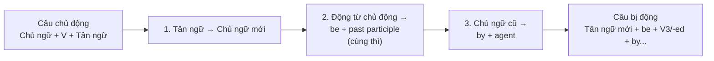

# Câu Bị Động (Passive Voice)

> (Trang 334–349)

---

*Trang 334*

---

## I. Câu Chủ Động Và Câu Bị Động (Active and Passive Sentences)

### 1. Câu Chủ Động (Active Sentences)

Câu chủ động là câu trong đó chủ ngữ là người hay vật thực hiện hành động.

`Ex: They built this house in 1486.` *(Họ xây ngôi nhà này năm 1486.)*
`This book will change your life.` *(Cuốn sách này sẽ làm thay đổi cuộc đời bạn.)*

### 2. Câu Bị Động (Passive Sentences)

Câu bị động là câu trong đó chủ ngữ là người hay vật nhận hoặc chịu tác động của hành động.

`Ex: This house was built in 1486.` *(Ngôi nhà này được xây năm 1486.)*
`Your life will be changed by this book.` *(Cuộc đời bạn sẽ được cuốn sách này làm cho thay đổi.)*

#### a. Hình thức (Form)

```
Subject + be + past participle (+ by + agent)
```

`Ex: This tree was planted by my grandfather.` *(Cây này do ông tôi trồng.)*
&nbsp;&nbsp;&nbsp;&nbsp;`S`&nbsp;&nbsp;&nbsp;`be + pp`&nbsp;&nbsp;&nbsp;&nbsp;&nbsp;&nbsp;&nbsp;`O (agent)`

#### b. Cách Dùng (Use)

Câu bị động (passive sentence) được dùng:

- Khi người hoặc vật thực hiện hành động đã rõ ràng.
  `Ex: The streets are swept every day.` *(Những con đường được quét mỗi ngày.)* [by street-sweepers]

- Khi không biết hoặc không cần biết đến người hoặc vật thực hiện hành động.
  `Ex: Oil has been discovered at the North Pole.` *(Dầu đã được tìm thấy ở Bắc Cực.)* [ai tìm thấy không quan trọng]
  `A lot of money has been stolen in the robbery.` *(Một lượng tiền lớn đã bị mất trong vụ cướp.)* [không biết ai đã đánh cướp]

- Khi người nói muốn nhấn mạnh người hoặc vật tiếp nhận hành động.
  `Ex: This house was built in 1486 by Sir John Latton.` *(Ngôi nhà này được ngài John Latton xây dựng năm 1486.)*

### 3. Cách Chuyển Sang Câu Bị Động (Passive Transformation)

Muốn chuyển một câu chủ động sang câu bị động, ta thực hiện các bước sau:



1. Lấy **tân ngữ (object)** của câu chủ động làm **chủ ngữ (subject)** của câu bị động.

---

*Trang 335*

---

2. Đổi động từ chủ động (Va) thành động từ bị động (Vp).

Bảng chuyển đổi thì từ chủ động sang bị động:

| TENSE | ACTIVE VOICE | PASSIVE STRUCTURE | PASSIVE VOICE |
|-------|-------------|-------------------|---------------|
| **Present simple** | People speak English here. | am / is / are + pp | English is spoken here. |
| **Present progressive** | They are painting the house. | am / is / are being + pp | The house is being painted. |
| **Past simple** | Somebody cleaned this room yesterday. | was / were + pp | This room was cleaned yesterday. |
| **Past progressive** | My sister was baking the cakes. | was / were being + pp | The cakes were being baked by my sister. |
| **Present perfect** | He hasn't worn the jacket for years. | have / has been + pp | The jacket hasn't been worn for years. |
| **Past perfect** | They had destroyed all the documents when we arrived. | had been + pp | All the documents had been destroyed when we arrived. |
| **Future simple** | I'll tell you when the time comes. | will be + pp | You'll be told when the time comes. |
| **Future progressive** | We will be holding talks at this time next year. | will be being + pp | Talks will be being held at this time next year. |
| **Future perfect** | You will have finished this report by Tuesday. | will have been + pp | This report will have been finished by Tuesday. |
| **Be going to** | We are going to buy her a gift. | am / is / are going to be + pp | She is going to be bought a gift. |
| **Modal verbs** | The manager must sign the cheque. | can, should, must... + be + pp | The cheque must be signed by the manager. |
| **Present infinitive** | I want you to do it as soon as possible. | to be + pp | I want it (to) be done as soon as possible. |
| **Perfect infinitive** | We hope to have finished the job by next Saturday. | to have been + pp | We hope the job (to) have been finished by next Saturday. |
| **Present participle / Gerund** | I don't like people telling me what to do. | being + pp | I don't like being told what to do. |
| **Perfect participle** | Having warned them about the bandits... | having been + pp | Having been warned about the bandits... |

---

*Trang 336*

---

> **Lưu ý:** Đôi khi **get** có thể được dùng thay cho **be** để diễn đạt những sự việc gây bất ngờ hoặc khó chịu.
>
> `Ex: There was an accident in the street but nobody got hurt.` *(Có một tai nạn xảy ra trên đường nhưng không ai bị thương.)* [= nobody was hurt]
>
> `The eggs got broken.` *(Trứng đã bị vỡ.)* [= were broken]

3. Chủ ngữ của câu chủ động thành **tác nhân (agent)** của câu bị động và trước nó phải có giới từ **by**.

`Ex: The President presented the medals.`
→ `The medals were presented by the President.`
*(Huân chương do Tổng thống trao tặng.)`

Chủ ngữ **I, you, he, she, it, we, they, one, people, someone, somebody, nobody, no one** trong câu chủ động thường được bỏ. Với **nobody** và **no one**, đổi động từ sang phủ định.

`Ex: Someone left this purse in a classroom.`
→ `This purse was left in a classroom.`
*(Ví tiền này đã bị bỏ quên trong lớp.)*

`Nobody saw him leaving the room.`
→ `He wasn't seen leaving the room.`
*(Anh ta đã rời khỏi phòng mà không bị phát hiện.)*

> **Lưu ý:** Dùng **with** (không dùng **by**) để chỉ dụng cụ, công cụ hoặc nguyên liệu được sử dụng.
>
> `Ex: He was shot (by the policeman) with a rifle.` *(Anh ta bị bắn bằng súng trường.)*
> `The room was filled with smoke.` *(Căn phòng đầy khói.)*

### Vị Trí Của Trạng Từ Hoặc Cụm Trạng Từ Trong Câu Bị Động

- **Trạng từ chỉ cách thức** thường đứng giữa **be** và **quá khứ phân từ (past participle)**. Các trạng từ khác thường đứng sau trợ động từ đầu tiên.
  `Ex: The problem has been carefully studied by the scientists.` *(Vấn đề đã được các nhà khoa học nghiên cứu kỹ.)*
  `She had never been promoted if she wouldn't have changed her job.` *(Nếu cô ấy không đổi việc thì cô ấy đã chẳng bao giờ được thăng chức.)*

- **Trạng từ hoặc cụm trạng từ chỉ nơi chốn** đứng trước **by + agent**.
  `Ex: He was found in the forest by the police.` *(Anh ta được cảnh sát tìm thấy trong rừng.)*

- **Trạng từ hoặc cụm trạng từ chỉ thời gian** đứng sau **by + agent**.
  `Ex: The report was typed by the secretary this morning.` *(Bản báo cáo đã được thư ký đánh máy sáng nay.)*

## II. Các Cấu Trúc Bị Động Đặc Biệt (Special Passive Structures)

### 1. Động Từ Với Hai Tân Ngữ (Verb with Two Objects)

Khi động từ chủ động có hai tân ngữ — **tân ngữ gián tiếp (indirect object)** chỉ người và **tân ngữ trực tiếp (direct object)** chỉ vật — thì cả hai tân ngữ đều có thể làm chủ ngữ cho câu bị động.

#### (a) Verb + indirect object (I.O) + direct object (D.O)

`Ex: He gave the police the information.`
&nbsp;&nbsp;&nbsp;&nbsp;&nbsp;&nbsp;&nbsp;&nbsp;&nbsp;`I.O`&nbsp;&nbsp;&nbsp;&nbsp;&nbsp;&nbsp;&nbsp;&nbsp;`D.O`

#### (b) Verb + direct object + *to* + indirect object

`Ex: He gave the information to the police.`
&nbsp;&nbsp;&nbsp;&nbsp;&nbsp;&nbsp;&nbsp;&nbsp;`D.O`&nbsp;&nbsp;&nbsp;&nbsp;&nbsp;&nbsp;&nbsp;&nbsp;&nbsp;`I.O`

---

*Trang 337*

---

Dạng bị động được thành lập bằng hai cách:

(a) **Tân ngữ gián tiếp (indirect object)** trở thành chủ ngữ của động từ bị động.

`Ex: The police were given the information.` *(Cảnh sát đã được cung cấp tin tức.)*

(b) **Tân ngữ trực tiếp (direct object)** trở thành chủ ngữ của động từ bị động.

`Ex: The information was given (to) the police.` *(Tin tức đã được cung cấp cho cảnh sát.)*

Việc lựa chọn giữa hai cấu trúc bị động tùy thuộc vào điều đã được nói trước đó, hoặc vào điều cần phải nhấn mạnh. Tuy nhiên tân ngữ gián tiếp (indirect object) thường được dùng làm chủ ngữ của động từ bị động hơn tân ngữ trực tiếp (direct object).

`Ex: They have awarded Andrew a prize for his essay.`
→ `Andrew has been awarded a prize for his essay.`
*(Andrew được trao giải thưởng cho bài tiểu luận của nó.)* [phổ biến hơn 'A prize has been awarded to Andrew for his essay.']

Giới từ **to** đôi khi được bỏ đi trước đại từ làm tân ngữ gián tiếp.

`Ex: Some flowers were sent (to) me by Harry.` *(Tôi được Harry gửi tặng vài bông hoa.)`

- Một số động từ thường dùng trong cấu trúc này gồm: **allow, award, ask, give, sell, send, show, lend, pay, promise, tell, offer, teach, refuse, write**.

> **Lưu ý:** Không dùng cấu trúc (a) với hai động từ **explain** và **suggest**.
>
> `Ex: We explained the problem to the children.`
> [NOT `We explained the children the problem.`]
> → `The problem was explained to the children.` *(Vấn đề đã được giải thích cho bọn trẻ.)*
> [NOT `The children were explained the problem.`]
>
> `They suggested a meeting place to us.`
> [NOT `They suggested us a meeting place.`]
> → `A meeting place was suggested to us.` *(Người ta đã đề xuất với chúng tôi một nơi gặp mặt.)*
> [NOT `We were suggested a meeting place.`]

### 2. Động Từ + Tân Ngữ + Động Từ Nguyên Mẫu Có To (Verb + Object + To-infinitive)

a. Các động từ chỉ cảm xúc hoặc mong ước: **like, hate, love, want, wish, prefer, hope... + object + to-infinitive** — dạng bị động được thành lập bằng cách dùng dạng bị động của động từ nguyên mẫu.

```
Subject + verb + object + to be + past participle
```

`Ex: He wants someone to take photographs.`
→ `He wants photographs to be taken.`
*(Anh ấy muốn những bức ảnh được chụp.)*

---

*Trang 338*

---

`I didn't expect the police to find my car.`
→ `I didn't expect my car to be found by the police.`
*(Tôi không hy vọng xe của tôi được cảnh sát tìm thấy.)*

`Do you wish me to serve dinner now?`
→ `Do you wish dinner to be served now?`
*(Anh có muốn bữa tối được dọn bây giờ không?)*

Nếu tân ngữ của động từ nguyên mẫu chỉ cùng một đối tượng với chủ ngữ của câu thì dạng bị động được thành lập không có tân ngữ.

```
Subject + verb + to be + past participle
```

`Ex: He likes people to call him 'Sir'.`
→ `He likes to be called 'Sir'.` *(Ông ấy thích được gọi bằng 'Ngài'.)*

`I prefer you to call me by my first name.`
→ `I prefer to be called by my first name.` *(Tôi thích được gọi bằng tên.)*

b. Các động từ chỉ mệnh lệnh, sự yêu cầu, sự cho phép, lời khuyên, lời mời, v.v.: **ask, tell, request, order, advise, invite, allow... + object + to-infinitive** — dạng bị động được thành lập bằng cách dùng dạng bị động của động từ chính.

```
Subject + passive verb + to-infinitive
```

`Ex: He asked me to send a stamped envelope.`
→ `I was asked to send a stamped envelope.`
*(Tôi được yêu cầu gửi một phong bì có dán tem.)*

`They advised us to come early.`
→ `We were advised to come early.` *(Chúng tôi được khuyên nên đến sớm.)*

`Her boss doesn't allow her to use the telephone.`
→ `She isn't allowed to use the telephone by her boss.`
*(Cô ấy không được ông chủ cho phép dùng điện thoại.)*

`He invited me to go out for dinner.`
→ `I was invited to go out for dinner.` *(Tôi được mời ra ngoài ăn tối.)`

- Dạng bị động này cũng được dùng cho một số động từ chỉ tri giác: **believe, consider, think, feel, know, understand... + object + to-infinitive** (thường là **to be**).

`Ex: They believe him to be innocent.`
→ `He is believed to be innocent.` *(Anh ta được cho là vô tội.)*

`They knew him to be a dangerous criminal.`
→ `He was known to be a dangerous criminal.`
*(Anh ta được biết như một tội phạm nguy hiểm.)*

> **Lưu ý:** **Advise, beg, order, recommend, urge + indirect object + to-infinitive + object** cũng có thể được đổi sang dạng bị động bằng **that... should + passive infinitive**.
>
> `Ex: He urged the Council to reduce the rates.` *(Anh ta kiến nghị Hội đồng giảm thuế.)*
> → `He urged that the rates should be reduced.` *(Anh ta kiến nghị rằng thuế cần phải được giảm bớt.)*
> → `The Council was/were urged to reduce the rates.` *(Hội đồng được kiến nghị cần phải giảm thuế.)*

---

*Trang 339*

---

### 3. Động Từ + Tân Ngữ + Động Từ Nguyên Mẫu Không To (Verb + Object + Bare-infinitive)

Các động từ chỉ giác quan: **feel, see, watch, notice, hear, listen to... + object + bare-infinitive** — dạng bị động được thành lập bằng cách dùng dạng bị động của động từ chính và động từ nguyên mẫu có **to (to-infinitive)**.

`Ex: We saw them go out of the house.`
→ `They were seen to go out of the house.` *(Người ta thấy họ ra khỏi nhà.)*

`I heard him run upstairs.`
→ `He was heard to run upstairs.` *(Người ta nghe tiếng anh ta chạy lên lầu.)`

- Dạng bị động này cũng được dùng cho động từ **make** và **help**.

`Ex: They made him tell the truth.`
→ `He was made to tell the truth.` *(Anh ta bị buộc phải khai ra sự thật.)*

`You should help the old carry their heavy bags.`
→ `The old should be helped to carry their heavy bags.`
*(Người già nên được mang giúp những túi nặng.)*

- **Let** được dùng không có **to**.

`Ex: They let us go.` → `We were let go.` *(Chúng tôi được để cho đi.)*

Tuy nhiên **let** ít được dùng ở dạng bị động, **allow** thường được dùng thay cho **let** trong câu bị động.

`Ex: We were allowed to go.`

### 4. Động Từ + Tân Ngữ + Danh Động Từ (Verb + Object + Gerund)

Động từ được theo sau bởi tân ngữ + danh động từ: **see, hear, find, stop, keep... + object + verb-ing** — dạng bị động được thành lập bằng cách dùng dạng bị động của động từ chính.

`Ex: He kept me waiting.`
→ `I was kept waiting.` *(Tôi buộc lòng phải chờ đợi.)*

`They have stopped traffic going into the scene of the accident.`
→ `Traffic has been stopped going into the scene of the accident.`
*(Xe cộ bị chặn lại không cho vào nơi xảy ra tai nạn.)*

`They saw the lorry running down the hill.`
→ `The lorry was seen running down the hill.` *(Người ta thấy chiếc xe tải lao xuống đồi.)*

Khi tân ngữ của danh động từ chỉ cùng một đối tượng với chủ ngữ của câu — dạng bị động được thành lập bằng cách dùng dạng bị động của danh động từ.

```
Subject + verb + passive gerund (being + pp)
```

`Ex: He doesn't like people laughing at him.`
→ `He doesn't like being laughed at.` *(Anh ấy không thích bị cười nhạo.)`

---

*Trang 340*

---

`I remember somebody giving me a toy drum on my fifth birthday.`
→ `I remember being given a toy drum on my fifth birthday.`
*(Tôi nhớ tôi được tặng một cái trống đồ chơi vào sinh nhật lần thứ năm.)*

### 5. Động Từ + Động Từ Nguyên Mẫu / Danh Động Từ + Tân Ngữ (Verb + To-infinitive / Gerund + Object)

Một số các động từ như: **advise, agree, insist, arrange, suggest, propose, recommend, determine, decide, demand, etc.** + **to-infinitive / gerund + object** thường được diễn đạt ở dạng bị động bằng mệnh đề **that (that clause)**.

`Ex: He decided to sell the house.`
→ `He decided that the house should be sold.`
*(Ông ta quyết định nên bán căn nhà.)*

`She suggested taking children to the zoo.`
→ `She suggested that the children should be taken to the zoo.`
*(Cô ấy gợi ý rằng nên đưa bọn trẻ đi sở thú.)*

### 6. Động Từ + Tân Ngữ + Bổ Ngữ Của Tân Ngữ (Verb + Object + Object Complement)

Tân ngữ trực tiếp sau một số động từ có thể được theo sau bởi một **bổ ngữ của tân ngữ** (bổ ngữ có thể là danh từ hoặc tính từ). Trong mệnh đề bị động, các bổ ngữ này trở thành bổ ngữ của chủ ngữ và theo sau động từ.

`Ex: They elected Mr. Sanderson president.`
→ `Mr. Sanderson was elected president.` *(Ông Sanderson được bầu làm chủ tịch.)*

`We believed him innocent.`
→ `He was believed innocent.` *(Anh ta được cho là vô tội.)*

`I will paint the door yellow.`
→ `The door will be painted yellow.` *(Cửa ra vào sẽ được sơn màu vàng.)*

`They regard Kathy as an expert.`
→ `Kathy is regarded as an expert.` *(Kathy được xem như một chuyên gia.)*

### 7. Động Từ + Mệnh Đề That (Verb + That-clause)

Khi mệnh đề that (that-clause) được dùng làm tân ngữ cho các động từ **agree, allege, announce, assume, hope, believe, claim, consider, estimate, expect, feel, find, know, report, rumor, say, think, understand, etc.** thì có hai cách chuyển sang bị động:

`Ex: People say that he is a good doctor.`
→ `He is said to be a good doctor.`
→ `It is said that he is a good doctor.`
*(Người ta nói rằng ông ấy là một bác sĩ giỏi.)*

---

*Trang 341*

---

`We know that he was a spy.`
→ `He is known to have been a spy.`
→ `It is known that he was a spy.`
*(Người ta biết rằng ông ta đã từng là một điệp viên.)`

> **Lưu ý:** Trong cách đổi thứ nhất (1) chúng ta phải xét đến thời gian xảy ra hành động trong mệnh đề that (that-clause) và mệnh đề chính (main clause).
>
> - Hành động trong mệnh đề that (that-clause) xảy ra đồng thời hoặc xảy ra sau hành động trong mệnh chính — dùng **present infinitive (to-infinitive)**.
>
> `Ex: People say that Henry is in love with Claire.`
> → `Henry is said to be in love with Claire.` *(Mọi người nói rằng Henry đang yêu Claire.)*
>
> `He didn't consider that she had a different idea.`
> *(Anh ấy không nghĩ đến việc cô ấy có ý kiến khác.)*
> → `She wasn't considered to have a different idea.`
>
> `They believed that she was living abroad.`
> → `She was believed to be living abroad.` *(Người ta cho rằng cô ấy đang sống ở nước ngoài.)*
>
> `They expect that the strike will end soon.`
> → `The strike is expected to end soon.` *(Người ta mong cuộc bãi công sẽ sớm kết thúc.)*
>
> - Hành động trong mệnh đề that xảy ra trước hành động trong mệnh đề chính — dùng **perfect infinitive (to have + past participle)**.
>
> `Ex: They report that two people were injured in the explosion.`
> → `Two people are reported to have been injured in the explosion.`
> *(Có hai người được cho là đã bị thương trong vụ nổ.)*
>
> `The police alleged that we had brought goods into the country illegally.`
> → `We were alleged to have brought goods into the country illegally by the police.`
> *(Chúng tôi bị cảnh sát cho là đã nhập khẩu hàng hóa trái phép.)*

### 8. Câu Mệnh Lệnh (Imperative Sentences)

Câu mệnh lệnh (imperative sentences): **Verb + object / Don't + verb + object** — dạng bị động được thành lập bằng cách dùng động từ **LET**.

`Ex: Write your name here.` → `Let your name be written here.` *(Hãy viết tên anh ở đây.)*
`Don't make so much noise.` → `Let not so much noise be made.` / `Don't let so much noise be made.` *(Đừng gây nhiều tiếng ồn như thế.)`

### 9. Một Số Động Từ Không Thể Chuyển Sang Bị Động

Chúng ta không dùng cấu trúc bị động với các nội động từ như: **die** hoặc **arrive** và các động từ chỉ trạng thái như: **fit, suit, have, lack, resemble, look, like, hold, contain, mean...**

`Ex: They have a nice house.` *(Họ có một ngôi nhà đẹp.)* [NOT `A nice house is had by them.`]
`These shoes don't fit me.` *(Đôi giày này không vừa chân tôi.)* [NOT `I am not fitted by these shoes.`]

---

*Trang 342*

---

`Sylvia resembles her mother.` *(Sylvia giống mẹ cô ấy.)* [NOT `Her mother is resembled by Sylvia.`]
`They were having dinner.` *(Họ đang ăn tối.)* [NOT `Dinner was being had by them.`]
`This barrel holds 25 litres.` *(Thùng này chứa được 25 lít.)* [NOT `25 litres are held by this barrel.`]

## III. Thể Sai Khiến (The Causative Form)

Thể sai khiến (causative form) được dùng để nói rằng chúng ta sắp xếp cho một người khác làm điều gì đó cho chúng ta, nghĩa là chủ ngữ không phải là người thực hiện hành động; chủ ngữ yêu cầu, sai bảo, cầu xin hoặc trả tiền cho người khác làm việc đó.

`Ex: He repaired the roof.` *(Anh ấy sửa mái nhà.)* — anh ấy tự làm
`He had the roof repaired.` *(Anh ấy nhờ người ta sửa mái nhà.)* — người khác làm

Thể sai khiến có thể được diễn đạt bằng hai cách: chủ động và bị động.

### 1. Chủ Động (Active)

Khi muốn đề cập đến người thực hiện hành động.

`Ex: The manager had his secretary prepare the report.` *(Giám đốc bảo thư ký của ông ấy chuẩn bị bản báo cáo.)*
`I'm going to get Harry to repair my car.` *(Tôi sẽ nhờ Harry sửa ô tô.)*

### 2. Bị Động (Passive)

Khi không muốn hoặc không cần đề cập đến người thực hiện hành động.

`Ex: You should have your car serviced regularly.`
*(Anh nên thường xuyên mang ô tô đi bảo trì.)*

`I lost my key. I'll have to get another key made.`
*(Tôi đã đánh mất chìa khóa. Tôi sẽ phải nhờ người làm chìa khóa khác.)*

---

*Trang 343*

---

> **Lưu ý:** Cấu trúc **have / get + object + past participle** còn được dùng để nói về điều gì đó (thường không tốt đẹp) xảy ra cho người nào đó.
>
> `Ex: We had all our money stolen while we were on holiday.` *(Chúng tôi bị mất cắp hết tiền khi đi nghỉ mát.)* [= All our money was stolen]
>
> `George had his nose broken in a fight.` *(George đã bị gãy mũi trong một vụ đánh nhau.)*

---

## Exercises

### I. Use the words in the box to complete these passive sentences. Use any appropriate tense.

> cause, blow, hold, collect, invite, not steal, show, translate, write, spell, surround, build, report, murder

1. An island _____ by water.
2. I _____ to the wedding but I couldn't come.
3. Many accidents _____ by reckless driving.
4. A new dormitory _____ in the campus at present.
5. A lot of the trees _____ down in a storm a few days ago.
6. Some politicians _____ by terrorists recently.
7. The concert _____ at the university next Sunday.
8. This money box _____ for five years.
9. The electric light bulb _____ by Thomas Edison.
10. The -ing form of 'sit' _____ with a double 't'.
11. The accident _____ in the newspaper yesterday.
12. Mickey Mouse cartoons _____ into sixty languages.
13. The election results _____ on television at the end of this month.
14. This program _____ by students at Stanford University.
15. Thank goodness! My jewellery _____ in the robbery last night.

### II. Put the verbs into the most suitable passive form.

1. There's someone behind us. I think we _____ (follow).
2. A mystery is something that _____ (can't / explain).
3. We didn't play football yesterday. The match _____ (cancel).
4. The television _____ (repair). It's working again now.
5. The church tower _____ (restore). The work is almost finished.
6. "How old is the tower?" "It _____ (believe) to be over 600 years old."
7. If I didn't do my job properly, I _____ (would / sack).
8. A: I left some papers on the desk last night and I can't find them now.
   B: They _____ (might / throw) away.
9. I learned to swim when I was very young. I _____ (teach) by my mother.
10. After _____ (arrest), I was taken to the police station.
11. This road _____ (repair), so we have to take another road.
12. Two people _____ (report) to _____ (injure) in an explosion at a factory early this morning.
13. I haven't received the letter. It _____ (might / send) to the wrong address.
14. The vegetables didn't taste very good. They _____ (cook) for too long.
15. The examination papers are scored by machine. The students _____ (tell) their results next week.

### III. Put these sentences into the passive voice.

1. Should they help Jane with the sewing?
2. The mechanic is repairing Judy's car.
3. Must we finish the test before ten?
4. They use a computer to do that job nowadays.
5. Employers must pay all travel expenses for this training course.
6. Did her story take them in?

---

*Trang 344*

---

7. The bank manager kept me waiting for half an hour.
8. Has he spelt this word wrongly?
9. All his friends will see him off at the airport.
10. They used to drink beer for breakfast in England years ago.
11. Someone might have sent the letter to the wrong address.
12. They were cleaning the floor when I arrived.
13. They are digging the hole on the wrong side of the road.
14. They are going to steal your money if you're not careful.
15. Has anyone ever asked you for your opinion?
16. Alan's knowledge of art doesn't impress me.
17. How do people make candles?
18. They can't make tea with cold water.
19. When is someone going to announce the results of the contest?
20. Nobody informed the police that there had been a mistake.
21. Where will your company send you next year?
22. Who looked after the children when you were away?
23. Look! Someone is feeding the seals.
24. Kathy had returned the book to the library.
25. By this time tomorrow, the president will have made the announcement.
26. The pollution in the city was affecting people's breathing.
27. Mrs Andrews hasn't signed those papers yet. Has Mr Andrews signed them yet?
28. Is a student pilot flying that airplane?
29. Where did they hold the 1988 Olympic Games?
30. Do they make those tractors in this country, or do they import them?

### IV. Change active to passive, paying close attention to special structures.

1. Parents always give me proper encouragement.
2. I remember someone giving me a toy drum on my fifth birthday.
3. Someone saw him pick up the gun.
4. They asked me some difficult questions at the interview.
5. Don't touch this switch.
6. He won't let you do that silly thing again.
7. The real estate office will send you a copy of the sales contract.
8. I didn't expect the police to find my car.
9. I rarely hear her call her children bad names.
10. Someone seems to have made a terrible mistake.
11. I think they should have offered Tom the job.
12. People say that Arthur robbed a bank a long time ago.
13. They used to make little boys climb the chimneys to clean them.
14. They suggested banning the sale of alcohol at football matches.
15. Take off your coat.
16. They have sent that money to the poor families.
17. He recommended using bullet-proof glass.
18. She loves someone praising her all the time.
19. We believe that he has special knowledge which may be useful to the police.
20. You need to have your hair cut.

---

*Trang 345*

---

### V. Put the verbs into the most suitable passive form.

7. The bank manager kept me waiting for half an hour.
8. Has he spelt this word wrongly?
9. All his friends will see him off at the airport.
10. They used to drink beer for breakfast in England years ago.
11. Someone might have sent the letter to the wrong address.
12. They were cleaning the floor when I arrived.
13. They are digging the hole on the wrong side of the road.
14. They are going to steal your money if you're not careful.
15. Has anyone ever asked you for your opinion?
16. Alan's knowledge of art doesn't impress me.
17. How do people make candles?
18. They can't make tea with cold water.
19. When is someone going to announce the results of the contest?
20. Nobody informed the police that there had been a mistake.
21. Where will your company send you next year?
22. Who looked after the children when you were away?
23. Look! Someone is feeding the seals.
24. Kathy had returned the book to the library.
25. By this time tomorrow, the president will have made the announcement.
26. The pollution in the city was affecting people's breathing.
27. Mrs Andrews hasn't signed those papers yet. Has Mr Andrews signed them yet?
28. Is a student pilot flying that airplane?
29. Where did they hold the 1988 Olympic Games?
30. Do they make those tractors in this country, or do they import them?

### VI. Change active to passive, paying close attention to special structures.

1. Parents always give me proper encouragement.
2. I remember someone giving me a toy drum on my fifth birthday.
3. Someone saw him pick up the gun.
4. They asked me some difficult questions at the interview.
5. Don't touch this switch.
6. He won't let you do that silly thing again.
7. The real estate office will send you a copy of the sales contract.
8. I didn't expect the police to find my car.
9. I rarely hear her call her children bad names.
10. Someone seems to have made a terrible mistake.
11. I think they should have offered Tom the job.
12. People say that Arthur robbed a bank a long time ago.
13. They used to make little boys climb the chimneys to clean them.
14. They suggested banning the sale of alcohol at football matches.
15. Take off your coat.
16. They have sent that money to the poor families.
17. He recommended using bullet-proof glass.
18. She loves someone praising her all the time.
19. We believe that he has special knowledge which may be useful to the police.
20. You need to have your hair cut.

---

*Trang 346*

---

### VI. Complete the sentences with the correct passive form.

1. A: _____ (you / pay) your electricity bill yet?
   B: No, but I'd better pay it today. If I don't, my electricity _____ (shut off) by the power company.

2. A: When _____ (your camera / steal)?
   B: Two months ago. While I was on my holiday, my camera _____ (disappear) from my hotel room.

3. A: Is the small lot behind your house still for sale?
   B: No, it _____ (sell) since last month and a new house _____ (build) on it next month.

4. A: I _____ (leave) some papers on the desk last night and I can't find them now.
   B: It _____ (might / throw) away.

5. A: What a nice garden! It _____ (must / take) good care of.
   B: That's right. We can see that the plants and flowers _____ (water) every day and the grass _____ (cut) regularly.

6. Can you come to the police station? The man who _____ (suspect) of stealing your wallet _____ (arrest), and _____ (question) at the moment. The police hope he _____ (identify), either by you or another witness.

7. The building at the end of the High Street is Barford Hall, which _____ (build) in 1827. Today the Hall _____ (own) by Bardale Council. It _____ (use) as a warehouse when it _____ (buy) by the Council in 1952, and it _____ (not look) after very well. Since then a lot of work _____ (do) on it, and these days the Hall _____ (use) as an art centre.

8. The Eiffel Tower _____ (be) in Paris, France. It _____ (visit) by millions of people every year. It _____ (design) by Alexandre Eiffel (1832-1923). It _____ (erect) in 1889 for the Paris exposition. Since that time, it _____ (be) the most famous landmark in Paris. Today it _____ (recognize) by people throughout the world.

9. Winton Castle _____ (damage) in a fire last night. The fire, which _____ (discover) at about 9 o'clock, spread very quickly. Nobody _____ (injure) but two people had to _____ (rescue) from an upstairs room. A number of paintings _____ (believe / destroy). It _____ (not / know) how the fire started.

10. Repair work started yesterday on the Paxham-Longworth road. The road _____ (resurface) now and there will be long delays. Drivers _____ (ask) to use an alternative route if possible. The work _____ (expect) to last two weeks. Next Sunday the road _____ (close) and traffic _____ (divert).

11. In Paxham yesterday a shop assistant _____ (force) to hand over £500 after _____ (threaten) by a man with a knife. The man escaped in a car which _____ (steal) earlier in the day. The car _____ (later / find) in a car park where it _____ (abandon) by the thief. A man _____ (arrest) in connection with the robbery and _____ (still / question) by the police.

### VII. Choose the correct verb forms in this news report about a storm.

Millions of pounds' worth of damage (1) _____ by a storm which (2) _____ across the north of England last night. The River Ribble (3) _____ its banks after heavy rain. Many people (4) _____ from the floods by fire-fighters, who (5) _____ hundreds of calls for help. Wind speeds (6) _____ ninety miles an hour in some places. Roads (7) _____ by fallen trees, and electricity lines (8) _____ down, leaving thousands of homes without electricity.

"Everything possible (9) _____ to get things back to normal," a spokesman (10) _____.

1. a. has caused b. has been caused c. caused
2. a. swept b. was swept c. was being swept
3. a. was burst b. has been burst c. burst
4. a. rescued b. were rescued c. be rescued
5. a. has received b. received c. were received
6. a. reached b. is reached c. were reached
7. a. has blocked b. blocked c. were blocked
8. a. were brought b. brought c. had brought
9. a. was done b. is being done c. is doing
10. a. said b. was said c. say

---

*Trang 347*

---

### VIII. Reply to what people say. Use the subject in brackets.

1. A: The bus fares have been increased. (they)
   B: What? You mean _____ again!
2. A: Bicycles should be used for short journeys. (people)
   B: Yes, I agree.
3. A: A new source of energy has been discovered. (someone)
   B: What? Did you say that _____?
4. A: This building is going to be knocked down. (they)
   B: Well, no one told me that _____.
5. A: Eggs shouldn't be kept in a freezer. (you)
   B: Really? I didn't know _____.
6. A: Why isn't litter put in the bin? (people)
   B: Exactly. Why don't _____?
7. A: A lot of money was stolen in the robbery. (the robbers)
   B: Really? The papers this morning don't say that _____.
8. A: The road in front of my house is being resurfaced at the moment. (they)
   B: What? Did you say that _____?
9. A: A decision will not be made until the next meeting. (the board)
   B: Well, I've heard that _____.
10. A: How is this word pronounced? (people)
    B: Sorry, I don't know _____.

### IX. Use the words in brackets to complete the sentence. Use the structure **have something done**.

1. We _____ (the house / paint) at the moment.
2. I lost my key. I'll have to _____ (another key / make).
3. When was the last time you _____ (your hair / cut)?
4. You look different. _____ (you / your hair / cut)?
5. _____ (you / a newspaper / deliver) to your house or do you go to the shop to buy one?
6. A: Can I see the photos you took when you were on holiday?
   B: I'm afraid I _____ (not / the film / develop) yet.
7. A: What are those workmen doing in your garden?
   B: Oh, we _____ (a swimming pool / build).
8. This coat is dirty. I must _____ (it / clean).
9. If you want to wear earrings, why don't you _____ (your ears / pierce)?

---

*Trang 348*

---

10. A: My car has been serviced recently.
    B: How often _____ (you / your car / service)?

### X. Complete the sentences, using the causative form.

1. David went to the hospital. A nurse bandaged his arm.
   → He had his arm bandaged.
2. Daniel is going to the dentist. He is going to fill his tooth.
   → He is going to have the dentist _____.
3. I didn't recognize Sheila. The hairdresser's dyed her hair red.
   → She's had her hair _____.
4. I've been getting a lot of annoying phone calls, so the telephone company is going to change my number.
   → So I'm going to get the telephone company _____.
5. Gabrielle broke her leg six weeks ago but she's much better now. In fact the doctors should be taking the plaster off tomorrow.
   → Gabrielle should be having the plaster _____.
6. Since Rowland made a lot of money, he's not content with his little house so an architect's designed him a fine new house.
   → Rowland has had an architect _____.
7. His room gets too hot when the sun shines so he's getting someone to fit blinds on the windows.
   → He's having blinds _____.
8. Anne is walking around town while her photos are being developed.
   → Anne is getting her photos _____.
9. We don't really know what Shakespeare looked like. I wish he had asked someone to paint his portrait before he died.
   → I wish Shakespeare had had his portrait _____.
10. My sister had always been self-conscious about her nose so she decided to go to a clinic for an operation to have it _____.

### XI. Complete the sentences, using the words in brackets.

1. "We have to test these products." (be)
2. A Belgian called Etienne Lenoir made the first motor car. (by)

---

*Trang 349*

---

3. Nigel's passport was taken away from him by the police. (took)
4. They pay babysitters a lot of money. (are)
5. I hope they'll interview me for the job. (to)
6. A mechanic is repairing Judy's car. (having)
7. Tessa lost her way. (got)
8. Everyone agreed that the plan should go ahead. (it)
9. When did they decorate your kitchen? (get)
10. They believe that he is living abroad. (be)
11. Pavarotti sang the song. (by)
12. Someone is cleaning the floor. (being)
13. Do you suppose your brother could have written such a letter? (been)
14. Laura had her brother repair her bicycle. (to)
15. Don't do that again. (be)

### XII. Choose the correct answer.

1. We can't go along here because the road _____.
   a. is repairing b. is repaired c. is being repaired d. repaires
2. The story I've just read _____ Agatha Christie.
   a. was written b. was written by c. was written from d. wrote by
3. Why don't you have your brother _____ the roof?
   a. repairs b. repair c. repaired d. to repair
4. The man died because medical help was not summoned. A doctor should _____.
   a. be have called b. been called c. be called d. have been called
5. Something funny _____ in class yesterday.
   a. happened b. was happened c. happens d. is happened
6. Many US automobiles _____ in Detroit, Michigan.
   a. manufacture b. have manufactured c. are manufactured d. are manufacturing
7. A lot of pesticide residue can _____ on unwashed produce.
   a. find b. found c. be finding d. be found
8. We _____ by a loud noise during the night.
   a. woke up b. are woken up c. were woken up d. were waking up
9. How did that window _____? ~ I don't know.
   a. get broken b. broke c. got broken d. broken
10. Some film stars _____ difficult to work with.
    a. are said be b. are said to be c. say to be d. said to be
11. Last night a tornado swept through Rockville. It _____ everything in its path.
    a. destroyed b. was destroyed c. was being destroyed d. has been destroyed
12. Vitamin C _____ by the human body. It gets into blood stream quickly.
    a. absorbs easily b. is easily absorbing c. is easily absorbed d. absorbed easily
13. "Why did Tom keep making jokes about me? I don't enjoy _____ at."
    a. be laughed b. to be laughed c. laughing d. being laughed
14. John _____ last week.
    a. had his house painted b. had painted his house c. had his father to paint d. had his house paint
15. Today, many serious childhood diseases _____ by early immunization.
    a. are preventing b. can prevent c. prevent d. can be prevented
16. "_____ about the eight o'clock flight to Chicago?" "Not yet."
    a. Has been an announcement made b. Has an announcement made c. Has an announcement been made d. Has been made an announcement
17. "Has the committee made its decision yet?" "Not yet. They are still _____ the proposal."
    a. considering b. been considered c. being considered d. considered
18. I might watch this programme. It _____ very funny.
    a. supposes to be b. is supposed being c. is supposed to be d. was supposed be
19. Do you get your heating _____ every year?
    a. checking b. check c. be checked d. checked
20. Claude Jennings is said _____ his memory.
    a. to have been lost b. to be lost c. to have lost d. to lose
